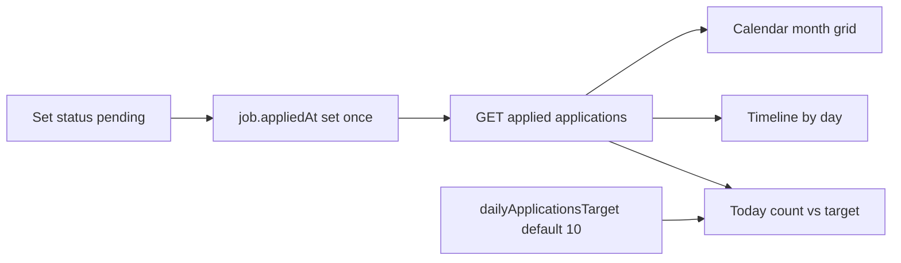

# Applications timeline, calendar, and daily target

## Context

[`/applications`](cv/services/web/app/applications/page.js) is a flat list of **generated packages** (`GET /applications` → `cv_applications` + package join). Pipeline “applied” state lives on jobs as `applicationStatus` (`apply` → **`pending`** → rounds / `rejected`), set via `PATCH /jobs/{id}/application-status` in [`main.py`](cv/services/api/main.py) (`_set_application_status`).

No daily goal setting exists yet. Settings are Mongo `cv_settings` via [`settings.py`](cv/services/shared/cv_shared/settings.py) + Settings UI.

**Data rule:** A job counts as an application when it has been set to **`pending`** (Easy Apply / status tracker). Interview/rejected stages after that still count as applied for the day they first hit pending — not re-counted when stage advances.

## Design



### 1. Persist stable apply timestamp

In [`_set_application_status`](cv/services/api/main.py) (and any agent path that uses the same helper):

- When new status is `pending` (or any track stage past apply: `pending` | `round1`–`round4`), if `job.appliedAt` is missing, `$set` **`appliedAt`** to now (ISO UTC).
- Do **not** set `appliedAt` on pure `apply` or on `rejected` unless already applied (rejected after pending keeps existing `appliedAt`).
- Never overwrite `appliedAt` once set.

This avoids using `applicationStatusAt` (which updates on every stage change) for day bucketing.

**Backfill on read (lazy):** for jobs with `applicationStatus` in applied stages but no `appliedAt`, fall back to first `cv_userDecisions` with `applicationStatus: "pending"` for that job, else `applicationStatusAt` if currently `pending` / beyond.

### 2. Settings: daily target (default 10)

- Field: **`dailyApplicationsTarget`** (int, camelCase), default **`10`**, clamp to a sensible range (e.g. 1–100).
- Wire through [`default_app_settings`](cv/services/shared/cv_shared/settings.py) / normalize / `get_app_settings` / `patch_app_settings`.
- [`SettingsPatchBody`](cv/services/api/main.py): add optional `dailyApplicationsTarget: int`.
- Settings UI ([`settings/page.js`](cv/services/web/app/settings/page.js)): small “Applications” section — number control + save via existing `apiPatch("/settings", …)`.
- Document field in [`COLLECTIONS.md`](cv/docs/COLLECTIONS.md) schema only if that file already documents `cv_settings` shape.

### 3. API: list applied applications (pipeline)

Keep package `GET /applications` working for other callers if any, and add a focused list:

- **`GET /applications/tracker`** (or query `GET /applications?mode=tracker`) returning jobs that have **`appliedAt`** or pipeline status in `pending|round1|…|round4|rejected` with apply evidence.

Each item (approx):

```js
{
  jobId, title, company, applicationStatus, appliedAt,
  applicationStatusAt, packageId? // optional if package exists
}
```

Sorted by `appliedAt` desc. Also return (or page can `GET /settings`) `dailyApplicationsTarget`.

Simplest client load: tracker list + settings in parallel from the page.

### 4. Applications page UI

Convert [`applications/page.js`](cv/services/web/app/applications/page.js) to a **client-driven** screen (page shell + client children), matching other interactive pages:

**Top: daily goal strip**

- Today’s count = items whose `appliedAt` falls on **local calendar day**.
- Display `appliedToday / dailyApplicationsTarget` with [`Progress`](cv/services/web/components/ui/progress.tsx) (same pattern as OpenAI usage on Settings).
- Subcopy when target met vs remaining.

**Toggle: Timeline | Calendar**

- Use existing [`ToggleGroup`](cv/services/web/components/ui/toggle-group.tsx) (pattern from [`CopilotSettings.js`](cv/services/web/app/components/CopilotSettings.js)).
- Persist mode in `localStorage` key e.g. `cv.applications.viewMode`.

**Timeline view**

- Group applied jobs by local date (`appliedAt`), newest day first.
- Day header: date label + count for that day.
- Rows: company / title, status badge, link to `/jobs/{id}` (reuse age-tone styling lightly if useful).

**Calendar view**

- Lightweight custom month grid (no new calendar dependency; no coss calendar primitive today): weekday headers, cells with **count** (and primary accent when count &gt; 0).
- Prev/next month controls; selected day shows that day’s applications below the grid (or empty state).
- Today cell highlighted; day with progress toward target can show filled/partial styling vs muted zero days.

**Copy shift:** subtitle from “Generated packages under …” → applied-tracking language; packages stay on job detail / generate flow.

### 5. Components (modular)

Under `cv/services/web/app/components/` (or `app/applications/`):

| Component | Role |
|-----------|------|
| `ApplicationsDailyGoal.js` | progress + counts |
| `ApplicationsViewToggle.js` | Timeline / Calendar ToggleGroup |
| `ApplicationsTimeline.js` | day-grouped list |
| `ApplicationsCalendar.js` | month grid + day detail |
| `lib/applicationDays.js` | local-day keys, bucket by `appliedAt`, today count helpers |

## Out of scope

- Changing what Easy Apply does beyond ensuring `appliedAt` is set when status becomes `pending` (same write path).
- Replacing package generation or the job-detail status tracker.
- Server-side timezone conversion for “today” (local client day is the product default).

## Files to touch

- [`cv/services/shared/cv_shared/settings.py`](cv/services/shared/cv_shared/settings.py) — default + normalize + patch
- [`cv/services/api/main.py`](cv/services/api/main.py) — settings body, `appliedAt` write, tracker list endpoint
- [`cv/services/web/app/settings/page.js`](cv/services/web/app/settings/page.js) — target input
- [`cv/services/web/app/applications/page.js`](cv/services/web/app/applications/page.js) + new small components/helpers
- [`cv/docs/COLLECTIONS.md`](cv/docs/COLLECTIONS.md) — `appliedAt` / settings field if documented there
