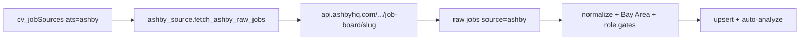

# Add Ashby as an ATS digest source

## Feasibility

**Yes.** Ashby exposes a public, unauthenticated Job Postings API:

`GET https://api.ashbyhq.com/posting-api/job-board/{JOB_BOARD_NAME}?includeCompensation=true`

- Same credential model as Greenhouse (none).
- One call returns the full board including `descriptionHtml` / `descriptionPlain`, locations, `jobUrl` / `applyUrl`, `isRemote` / `workplaceType`, optional compensation.
- **No two-phase list→detail fetch** needed (unlike Greenhouse).
- You must know each org’s board slug up front (no discovery API) — same as Greenhouse `boardToken`.

Roadmap today lists this as Stage **2C** (“Lever (+ Ashby…)”) in [`cv/docs/ROADMAP.md`](cv/docs/ROADMAP.md); there is **no** `ashby_source.py` yet. Gmail URL heuristics already recognize `ashby` hosts.

## What you need (non-code)

| Requirement | Detail |
|---|---|
| Board slugs | From careers URLs: `https://jobs.ashbyhq.com/{slug}` → `boardToken` / `JOB_BOARD_NAME` |
| No secrets | Public posting API only; do not use Ashby’s private authenticated API |
| Watchlist | Seed or add via Sources UI (same `cv_jobSources` collection, unique on `(ats, boardToken)`) |
| Settings toggle | Master `atsIngest.ashby` (parallel to Greenhouse) |

## Code work (mirror Greenhouse)

### 1. Adapter — new [`cv/services/shared/cv_shared/intake/ashby_source.py`](cv/services/shared/cv_shared/intake/ashby_source.py)

Clone patterns from [`greenhouse_source.py`](cv/services/shared/cv_shared/intake/greenhouse_source.py):

- `probe_board_token(slug)` — GET board; 200 + `jobs` array = valid
- `fetch_board_jobs(slug)` — one request with `includeCompensation=true`
- `early_keep_ashby_listing(job, source)` — title + location (+ `secondaryLocations`, `isRemote`) against source `locations[]` and Bay Area/role gates
- `ashby_job_to_raw(...)` → shared raw shape:
  - `externalId`: `ashby:{boardToken}:{id or jobUrl hash}`
  - `source`: `"ashby"`
  - descriptions from `descriptionHtml` / `descriptionPlain`
  - skip unlisted (`isListed === false`) unless we intentionally keep direct-link roles
- `fetch_ashby_raw_jobs(source_ids=…)` + poll stats on the source doc (`lastPolledAt`, `lastJobCount`, errors)

### 2. Settings — [`cv/services/shared/cv_shared/settings.py`](cv/services/shared/cv_shared/settings.py)

- Add `"ashby"` to `ATS_INGEST_KEYS` / defaults (`atsIngest.ashby: true`)
- No `ashbyTwoPhase` flag (single-shot API)

### 3. Pipeline — [`cv/services/shared/cv_shared/intake/pipeline.py`](cv/services/shared/cv_shared/intake/pipeline.py)

- Allow `sources_mode` `"ashby"` (and include in `"all"` after Greenhouse)
- Skip HTML enrich for `source == "ashby"` (same as Greenhouse)
- Count prefix `ashbyJobsCreated` / `ashbyJobsUpdated` (or reuse generic ATS counters if preferred — keep Ashby-prefixed for parity with Greenhouse)

### 4. API — [`cv/services/api/main.py`](cv/services/api/main.py)

- `POST /sources`: accept `ats: "ashby"`, probe Ashby, set `careersUrl` to `https://jobs.ashbyhq.com/{token}`
- `POST /sources/{id}/poll`: allow Ashby when master + per-source enabled
- `POST /ingest/run?sources=ashby`

### 5. UI

- Settings: add Ashby to `ATS_PROVIDERS` in [`cv/services/web/app/settings/page.js`](cv/services/web/app/settings/page.js)
- Sources: ATS selector (Greenhouse | Ashby), poll-all Ashby, master-toggle banner — [`cv/services/web/app/sources/page.js`](cv/services/web/app/sources/page.js)
- Inbox: label `source === "ashby"` if chips exist in [`cv/services/web/app/page.js`](cv/services/web/app/page.js)

### 6. Manual Analyze URL (small follow-on in same PR)

- [`url_to_raw.py`](cv/services/shared/cv_shared/intake/url_to_raw.py): parse `jobs.ashbyhq.com/{org}/{jobId}` → fetch board or use posting fields so pasted Ashby links skip scrape enrich

### 7. Docs / seed

- Short [`cv/docs/ASHBY_SETUP.md`](cv/docs/ASHBY_SETUP.md) (slug how-to + public API note)
- Update COLLECTIONS / ROADMAP; add a few seed rows only once you name specific boards (empty watchlist is fine at ship)

## Out of scope

- Ashby private API / API keys
- Lever (still separate 2C item)
- Auto-discovery of all Ashby companies

## Effort estimate

Roughly a Greenhouse-sized adapter: **~1 focused PR** (adapter + settings + pipeline branch + Sources/Settings UI + optional URL path). Simpler than Greenhouse because descriptions come in the list response.
