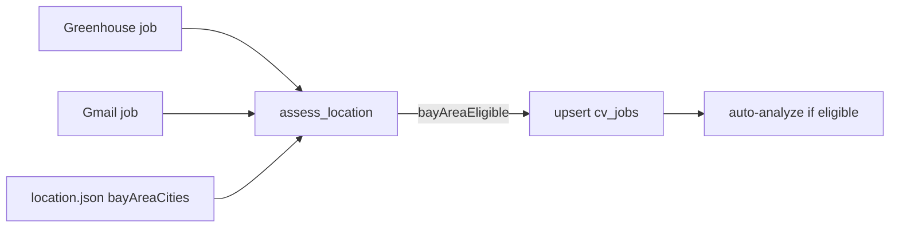

# Bay Area cities + remote-always for Greenhouse (shared gate)

## Best way to handle this

**Do not add a Greenhouse-only city filter.** Greenhouse jobs already go through the same path as Gmail:

`normalize_raw_job` → [`assess_location`](cv/services/shared/cv_shared/intake/location.py) → `bayAreaEligible` / `status: out_of_area` → auto-analyze only if eligible.

The city allowlist already lives in [`cv/config/location.json`](cv/config/location.json) as `bayAreaCities` — your Set is essentially the same list (plus region aliases like `bay area`, `sf`, `east bay`). Editing that config updates **Gmail + Greenhouse + manual** in one place. No second list on Sources / seed `locations` fields (those are hints only today, not a hard gate).

**Why not Settings UI yet:** a Mongo-editable city list is Stage-3-adjacent polish. Config JSON is enough for add/remove; restart/reload picks it up via `load_location_config` (cached — see note below).

## What changes

### 1. Keep / sync city list in `location.json`

[`cv/config/location.json`](cv/config/location.json) already has your cities. Keep them as the allowlist for hybrid/onsite office matching.

Also keep short region aliases that help matching (`bay area`, `sf`, `east bay`, `south bay`, `peninsula`) — they are not “cities” but prevent false `out_of_area` on “SF Bay Area” listings.

Mirror the same city list into `_DEFAULT_CONFIG` in [`location.py`](cv/services/shared/cv_shared/intake/location.py) so Docker/host fallbacks stay consistent.

### 2. Remote policy: always accept remote (with CA exclusion)

Today remote is only eligible if CA/US tokens (or Bay Area alert location) are present. You asked for **remote always accepted**.

Change eligibility in `assess_location`:

| Case | Result |
|---|---|
| Explicit CA exclusion (“except California”, etc.) | Not eligible (unchanged) |
| `workArrangement == remote` | Eligible (new: even if geo unknown / non-US) |
| Hybrid / onsite | Eligible only if office city / Bay Area phrase matches `bayAreaCities` |
| Unknown arrangement + Bay Area city mention | Eligible (unchanged) |

Evidence string e.g. `remote always eligible`.

### 3. Clear location config cache on reload

`load_location_config` is `@lru_cache(maxsize=1)`. After editing JSON, a process restart is required today. Add a tiny `reload_location_config()` used by seed/startup (or document restart). For this change: call `load_location_config.cache_clear()` from a documented helper; no Settings UI.

### 4. Docs

- [`GREENHOUSE_SETUP.md`](cv/docs/GREENHOUSE_SETUP.md): cities come from `config/location.json`; remote always eligible; how to add/remove a city
- Short note in [`ARCHITECTURE.md`](cv/docs/ARCHITECTURE.md) location gate paragraph

## Out of scope

- Per-company city overrides on Sources
- Settings UI editor for the city list
- Live commute APIs / Stage 3 reweight

## Acceptance

- Greenhouse onsite/hybrid outside the city list → `out_of_area`, not auto-analyzed
- Greenhouse remote (no city) → eligible and auto-analyzed (unless CA excluded)
- Gmail uses the same rules
- Editing `bayAreaCities` in `location.json` + API/worker restart changes the gate
