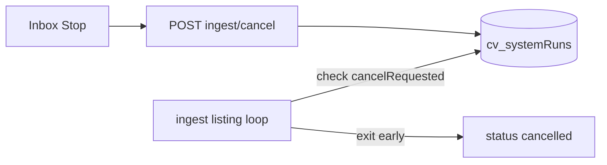

# Stop and clear current ingest

## Right now (no code yet)

There is **no cancel API**. The banner is driven by `cv_systemRuns` with `status: "running"`. Work runs in a daemon thread inside the API process.

To stop the current runaway immediately:

```bash
cd cv
docker compose restart api
# Then clear the lock so the next Fetch is not 409'd:
docker compose exec mongo mongosh DTP --eval \
  'db.cv_systemRuns.updateMany({type:"ingest",status:"running"},{$set:{status:"cancelled",finishedAt:new Date().toISOString(),currentTitle:"Cancelled (manual)"}})'
```

(Adjust service name if your Mongo container differs.) That kills the thread and clears single-flight. Already-upserted jobs remain; delete via Inbox multi-select if you want them gone.

`4/8984` is almost certainly **Greenhouse board fan-out** (e.g. Stripe) plus Gmail, not one digest — title `@ Stripe` matches ATS poll, not a Glassdoor card.

---

## Product fix (this plan)



### 1. Cooperative cancel in pipeline

In [`pipeline.py`](cv/services/shared/cv_shared/intake/pipeline.py):

- Add `cancel_ingest(run_id=None)` — find latest `type:ingest,status:running`, set `cancelRequested: true` (and optionally `status` stays `running` until the worker notices).
- In `_ingest_raw_jobs` (and between Gmail / Greenhouse / manual phases in `run_ingest`), before each listing: if the run doc has `cancelRequested`, set `status: "cancelled"`, `finishedAt`, stop processing further listings, return.
- Do **not** mark unprocessed Gmail messages as done on cancel (keep existing failure semantics for untouched mail).
- `start_ingest_async`: treat `status: "cancelled"` / `"failed"` / `"completed"` as free; only `running` blocks. Add `POST`-style clear: if a run is `running` but `cancelRequested` and process died, allow `force=true` on cancel to flip stuck `running` → `cancelled` without a live worker (ops + UI “Force clear”).

### 2. API

- `POST /ingest/cancel` → `{ runId, status: "cancelling" }` or 404 if nothing running.
- `POST /ingest/cancel?force=true` → mark any `running` ingest `cancelled` even if the thread is dead (clears single-flight lock).

### 3. Inbox UI

In [`page.js`](cv/services/web/app/page.js): while ingesting, show **Stop ingest** next to the banner. Calls `/ingest/cancel`, then polls until status is `cancelled`/`completed`/`failed`. If status stays `running` after ~10s with no progress, offer **Force clear lock**.

### 4. Safety rail (same change set)

Cap total listings per ingest run (e.g. env `INGEST_MAX_LISTINGS` default **500**): after fetch, if `len(raw_jobs) > max`, truncate with a warning in `errors[]` / `currentTitle`. Prevents another 8k sequential analyze loop from Greenhouse+Gmail without noticing.

## Out of scope

- Deleting jobs created mid-run (use existing bulk delete)
- Redis/Celery kill
- Changing Greenhouse watchlist contents

## Acceptance

- Stop button ends the active run; banner shows cancelled; Fetch new alerts works again without restart
- Force clear unlocks a stuck `running` doc after API crash/restart
- A huge Greenhouse poll cannot exceed `INGEST_MAX_LISTINGS` in one run
