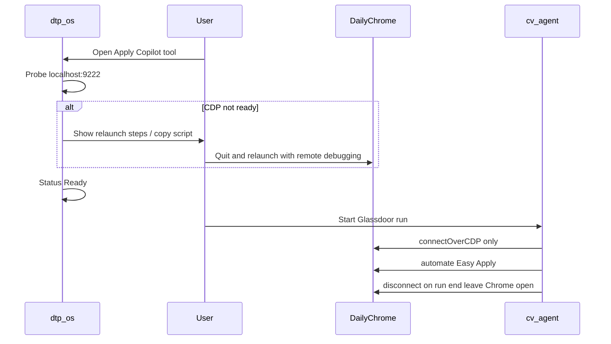

# CDP attach to existing Chrome session

## Constraint (locked)

Chrome **cannot** turn on remote debugging for a process that is already running. To control your real session (cookies, Glassdoor login), Chrome must be **restarted once** with `--remote-debugging-port` and **no custom `--user-data-dir`** (uses your default profile). After that, the agent only attaches; it never spawns a second profile.



## Part A — Agent: attach-only (dtp-yui)

Change [`cv/services/agent/src/browser.js`](cv/services/agent/src/browser.js):

- In CDP mode, **never call** `spawnChromeForCdp`.
- Always wait for `resolveCdpEndpoint()` (`CV_AGENT_CDP_URL` or `http://127.0.0.1:${CV_AGENT_CDP_PORT}`).
- If DevTools is not ready within ~15s, fail with a clear error pointing at the dtp-os setup tool / relaunch script (no silent fallback to spawn).
- `handle.close()` for CDP: **disconnect only** — never `browser.close()` / never kill a process (there is no owned process).
- Keep `CV_AGENT_CDP_SPAWN=1` as an escape hatch for the old dedicated-profile spawn (off by default); document as legacy.

Update env ([`.env`](cv/services/agent/.env), [`.env.example`](cv/services/agent/.env.example)):

```bash
CV_AGENT_BROWSER=chromium
CV_AGENT_BROWSER_MODE=cdp
CV_AGENT_CDP_URL=http://127.0.0.1:9222
# CV_AGENT_CDP_SPAWN=0   # default; do not spawn a second Chrome
```

Update runner status/events and docs ([`AGENT_SETUP.md`](cv/docs/AGENT_SETUP.md), [`ARCHITECTURE.md`](cv/docs/ARCHITECTURE.md)): attach to daily Chrome; run end leaves Chrome open; security note (localhost CDP = full browser control).

## Part B — Relaunch helper script

Add a macOS-first script in the agent repo (callable from dtp-os copy button):

[`cv/services/agent/scripts/relaunch-chrome-cdp.sh`](cv/services/agent/scripts/relaunch-chrome-cdp.sh)

Behavior:

1. Quit Google Chrome gracefully (`osascript` quit, wait until gone).
2. Start `/Applications/Google Chrome.app/.../Google Chrome` with:
   - `--remote-debugging-port=9222`
   - `--no-first-run` / `--no-default-browser-check`
   - **no** `--user-data-dir` (keeps default session)
3. Poll `http://127.0.0.1:9222/json/version` until ready; print OK.

Warn in comments/UI: closes all Chrome windows; only use when ready to restart the browser.

## Part C — dtp-os tool: Apply Copilot CDP

New popup tool following existing registration pattern:

| Step | File |
|---|---|
| Tool id | [`js/toolSettings.js`](js/toolSettings.js) → `APPLY_COPILOT: "apply-copilot"` |
| Icon | [`js/toolIcons.js`](js/toolIcons.js) + `assets/tools/apply-copilot.svg` |
| Mount | [`js/popup.js`](js/popup.js) `TOOL_DEFINITIONS` / `TOOL_MOUNTERS` |
| UI | `js/applyCopilotTool.js` (+ small CSS in `css/popup.css` / tokens) |

Tool UI (vanilla JS + existing dark/hot-pink tokens):

1. **Status** — `fetch('http://127.0.0.1:9222/json/version')` → Ready / Not listening (Browser name + webSocketDebuggerUrl when ready).
2. **Refresh** button + auto-poll every few seconds while panel open.
3. **Copy relaunch command** — copies the shell one-liner / path to `relaunch-chrome-cdp.sh` (absolute path under `dtp-yui` if known via setting, else generic command).
4. **Setup steps** — short numbered list: run script → confirm Ready → start Copilot agent with `CV_AGENT_CDP_URL`.
5. Optional stored setting: `applyCopilotCdpUrl` / `applyCopilotScriptPath` in `chrome.storage.local` (camelCase).

No `nativeMessaging` and no `chrome.debugger` in this pass (debugger API does not expose a port for Playwright). Native host can be a later upgrade if one-click quit/relaunch without Terminal is required.

Update [`docs/architecture.md`](/Users/argo/Code/dtp/dtp-os/docs/architecture.md) and wishlist if present.

## Out of scope

- Sharing/controlling Chrome without any restart
- OpenClaw / BrowserClaw
- Docker headless agent using the user’s daily profile
- Auto-killing the user’s Chrome when a Copilot run ends

## Acceptance

1. With Chrome not on `:9222`, agent CDP start fails with a clear “start Chrome via dtp-os / relaunch script” message (does not spawn `browser-profile-cdp`).
2. After running relaunch script, daily Chrome is on `:9222`; dtp-os tool shows Ready.
3. Copilot run attaches, drives Glassdoor on that session, and on stop Chrome stays open with the same profile.
4. `chrome://version` in that window is system Google Chrome using the default profile path (not `browser-profile-cdp`).
