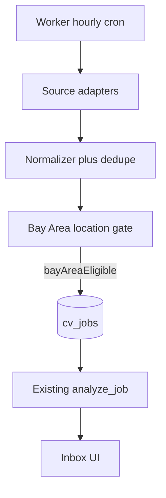

# CV next stages — intake-first roadmap

## What’s already done (keep leveraging)

Stage 1 + Gap Insights give you the **downstream pipeline**: normalize into `cv_jobs` → analyze → `cv_jobMatches` / `cv_gapInsights` → generate docs → human decide. Worker already has an hourly stub at [`cv/services/worker/main.py`](cv/services/worker/main.py). Secrets layout is stubbed for Gmail in [`cv/secrets/README.md`](cv/secrets/README.md). Collection names `cv_jobSources` / `cv_gmailMessages` already exist as stubs.

**Do not rebuild matching or doc gen.** New stages should only feed jobs into that pipeline.

## Strategic shift vs old ROADMAP

| Old | New |
|---|---|
| Stage 2 = LinkedIn Gmail only | Stage 2 = **multi-source intake**, LinkedIn is just one email sender |
| Greenhouse/Lever not planned | Stage 2B/2C = **company-first ATS APIs** |
| Location = soft field | **Bay Area eligibility is a hard gate** before auto-analyze |
| LinkedIn scraping later | **Explicitly last / optional enrichment only** |



---

## Revised stage map

### Stage 2A — Email intake + foundation *(immediate next — highest value)*

See detailed breakdown below.

### Stage 2B — Bay Area company watchlist + Greenhouse

- Seed `cv_jobSources` / config JSON for ~50–150 priority companies with `ats: greenhouse`, `boardToken`, `priority`, `locations`
- Adapter: `GET https://boards-api.greenhouse.io/v1/boards/{token}/jobs?content=true`
- Same normalizer → location gate → upsert → analyze
- UI: simple Sources page (list companies, last poll, error)

### Stage 2C — Lever (+ Ashby only if watchlist demands it)

- Lever Postings API adapter (same interface as Greenhouse)
- After watchlist audit: if N≥~10 priority cos use Ashby, add Ashby next; else skip

### Stage 3 — Logistics scoring + notify

- Commute tiers from Oakland (preferred / acceptable / conditional) — config, not live transit APIs
- Reweight match score with work-arrangement + commute (per your weights)
- Gmail digest / Telegram: urgent ≥85, digest 70–84 (from old Stage 2 plan)

### Stage 4 — GitHub evidence engine *(old Stage 3)*

Unchanged intent: poll repos, evidence ladder, bump `profileVersion`, rescore open jobs.

### Stage 5 — Application tracker *(old Stage 4)*

Full pipeline statuses + learn from decisions + cleanup.

### Stage 6 — Browser assist *(old Stage 5)*

Playwright fill external ATS, pause before submit. LinkedIn Easy Apply still out of scope.

### Explicitly deferred

- LinkedIn browser automation / scraping
- Mass remote APIs (Remotive, etc.) as primary intake
- USAJOBS unless you opt in
- Live commute APIs

---

## Stage 2A detail (implement next)

**Goal:** Every hour, pull new job-alert emails, turn them into deduped `cv_jobs` with Bay Area eligibility, auto-run existing `analyze_job`, and show them in Inbox — without Greenhouse yet.

### Why this first

- Job boards do discovery for you (LinkedIn, Indeed, Built In, Wellfound, Google Jobs alerts)
- No ATS board tokens or company list required to get value
- Reuses Stage 1 analyze / gaps / delete / generate immediately
- Location gate prevents Inbox drowning in national remote noise

### Deliverables

**1. Shared intake contract** (new module, e.g. [`cv/services/shared/cv_shared/intake/`](cv/services/shared/cv_shared/))

```text
JobSource.fetch_since(since) -> list[RawJob]
normalize(raw) -> NormalizedJob
fingerprint(company, title, location) -> exact + fuzzy
upsert_job(normalized) -> jobId | None  # contentHash / externalId / fuzzy dedupe
```

Extend `cv_jobs` fields (camelCase): `externalId`, `source`, `sourceUrl`, `canonicalApplyUrl`, `discoveredBy`, `locationAssessment`, `firstSeenAt`, `lastSeenAt`, `fingerprints`. Keep Stage 1 manual paste working (`source: "manual"`).

**2. Bay Area location classifier** (rule-first, LLM fallback only if ambiguous)

- Config: `bayAreaCities`, `commuteTiers` (Oakland-centric) in seed/config JSON
- Output: `workArrangement`, `geographicEligibility`, `bayAreaEligible`, `officeCities`, `confidence`, `evidence[]`
- Worker policy: **skip auto-analyze** (or mark `status: out_of_area`) when `bayAreaEligible === false`
- Remote US/CA with no CA exclusion → eligible; “except California” → not

**3. Gmail adapter**

- OAuth desktop client; tokens under `cv/secrets/` (already documented)
- Search e.g. `newer_than:1d (from:jobalerts-noreply@linkedin.com OR from:…indeed… OR label:JobAlerts)`
- Persist processed ids in `cv_gmailMessages`
- Parse title/company/snippet/link; resolve redirects to prefer company apply URL when possible
- Store `discoveredBy: { source, alertName?, alertLocation? }`

**4. Worker wiring**

- Replace `stub_ingest_jobs` in [`cv/services/worker/main.py`](cv/services/worker/main.py)
- Flow: fetch → normalize → dedupe → location classify → insert → `analyze_job` for new eligible jobs
- Log run into `cv_systemRuns`

**5. UI (minimal)**

- Inbox: show `source` badge + Bay Area / remote / hybrid chip
- Optional filter: Eligible only / All
- No full Sources admin UI yet (config file is enough for 2A)

**6. Docs**

- Rewrite [`cv/docs/ROADMAP.md`](cv/docs/ROADMAP.md) to this stage map
- Document new fields in [`cv/docs/COLLECTIONS.md`](cv/docs/COLLECTIONS.md)
- **New dedicated guide:** [`cv/docs/GMAIL_SETUP.md`](cv/docs/GMAIL_SETUP.md) — how to set up the Gmail inbox for job-alert intake (not just a blurb in README)
- Short pointers from [`cv/README.md`](cv/README.md) and [`cv/secrets/README.md`](cv/secrets/README.md) → `docs/GMAIL_SETUP.md`

### `cv/docs/GMAIL_SETUP.md` contents (required)

Dedicated operator doc covering:

1. **Dedicated vs personal inbox** — recommend a dedicated Gmail (or clear label isolation) so job alerts stay separable from personal mail
2. **Google Cloud OAuth** — create Desktop OAuth client, enable Gmail API, download client secret to `cv/secrets/gmail-client-secret.json`
3. **First-time auth** — run the local token flow; where `gmail-token.json` lands; scopes needed (readonly is enough for Stage 2A)
4. **Job alert subscriptions** — how to create narrow LinkedIn / Indeed / Built In / Wellfound / Google Jobs alerts aimed at Bay Area + role families; send all to this inbox
5. **Gmail labels + filters** — create `JobAlerts` (and optional per-source labels); auto-label by sender so ingest can use `label:JobAlerts`
6. **Example Gmail search** the worker will use (document the exact query string)
7. **Processed mail** — optional `AI Job Agent/Processed` label behavior
8. **Verification checklist** — send a test alert, run ingest, confirm a job appears in Inbox
9. **Security** — secrets never committed; localhost-only; revoke/re-auth steps

### Out of Stage 2A

- Greenhouse / Lever polling
- Commute minutes scoring (tiers stored, but full reweight is Stage 3)
- Telegram/email digests (Stage 3)
- Company watchlist UI

### Acceptance criteria

- With Gmail connected and a few Bay Area alerts labeled, hourly (or manual “Run ingest”) creates jobs that appear in Inbox scored
- Re-running ingest does not duplicate the same listing
- Non–Bay Area alerts are stored or skipped per policy but do not flood “apply now” recommendations
- Manual Analyze paste path still works unchanged
- [`cv/docs/GMAIL_SETUP.md`](cv/docs/GMAIL_SETUP.md) exists and is linked from README / secrets README so setup is followable without reading code

### Suggested implementation todos (when you approve build)

1. Intake package: types, normalizer, fingerprints, `upsert_job`
2. Location classifier + config JSON
3. Gmail OAuth + fetch/parse + `cv_gmailMessages`
4. Worker ingest job + optional `POST /ingest/run` for manual trigger
5. Inbox source/location chips + eligible filter
6. ROADMAP + COLLECTIONS updates
7. **Create `cv/docs/GMAIL_SETUP.md`** + link from README and `secrets/README.md`

---

## Prerequisite you do outside code (before/during 2A)

Follow [`cv/docs/GMAIL_SETUP.md`](cv/docs/GMAIL_SETUP.md) (once written): create **narrow** job alerts (Bay Area cities + role families) and a Gmail label `JobAlerts` so the ingest query stays simple. Without good alerts, Stage 2A has little to ingest.
