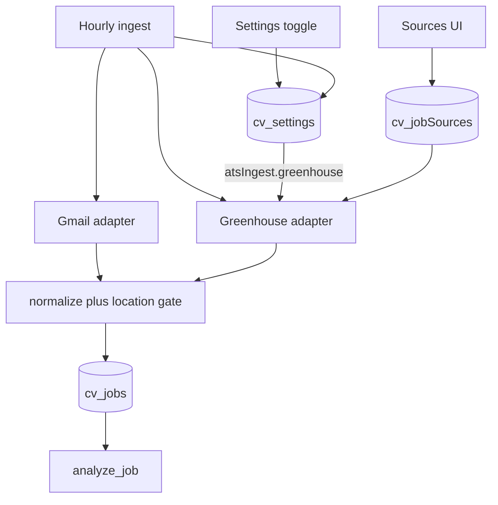

# Stage 2B — Bay Area company watchlist + Greenhouse

## Goal

Poll curated Greenhouse career boards hourly, feed listings through the existing Stage 2A pipeline (normalize → Bay Area gate → upsert → auto-analyze), and expose a simple Sources UI for last-poll / errors. Reuse matching and doc gen unchanged.

## Current foundation (reuse, do not rebuild)

- Protocol: [`cv/services/shared/cv_shared/intake/base.py`](cv/services/shared/cv_shared/intake/base.py) — `JobSource.fetch_jobs(since) -> list[dict]`
- Pipeline: [`cv/services/shared/cv_shared/intake/pipeline.py`](cv/services/shared/cv_shared/intake/pipeline.py) — Gmail-only today; already does enrich → `normalize_raw_job` → `upsert_normalized_job` → gated `analyze_job`
- Collection stub: `cv_jobSources` constant + `enabled` index in [`db.py`](cv/services/shared/cv_shared/db.py); no reads/writes yet
- Inbox already shows arbitrary `source` pills — Greenhouse jobs need no Inbox chip work beyond `source: "greenhouse"`



## Decisions (locked)

| Topic | Choice |
|---|---|
| Watchlist content | Starter seed JSON of ~40–60 well-known Bay Area / hybrid-friendly companies with public Greenhouse board tokens; extend via seed edit or Sources Add form |
| Config vs DB | Seed file upserts into `cv_jobSources` (runtime source of truth for poll state); re-seed upserts identity fields without wiping `lastPolledAt` / errors |
| Pipeline | Same hourly `run_ingest` runs Gmail then Greenhouse (not a separate cron); summary includes per-source counts |
| Greenhouse API | Public boards API only — no API key: `GET https://boards-api.greenhouse.io/v1/boards/{token}/jobs?content=true` |
| Rate limit | Sequential board polls with a short delay (~200–300ms); per-source `lastError` on failure; continue other boards |
| Dedup | `externalId = greenhouse:{boardToken}:{jobId}` + existing fingerprint/`contentHash` path |
| Settings vs Sources enable | **Settings** = master on/off for all Greenhouse polling (`atsIngest.greenhouse`). **Sources** per-company `enabled` = which boards poll when the master is on. Both required to poll a board |
| Sources UI | List + enable/disable + last poll/error/job count + Poll now; simple add for name / boardToken / priority |
| Out of 2B | Lever/Ashby (2C), commute reweight/digests (3), LinkedIn scraping |

**Note:** Settings today only has Gmail alert toggles ([`settings.py`](cv/services/shared/cv_shared/settings.py) / [`settings/page.js`](cv/services/web/app/settings/page.js)). The Settings+Glassdoor plan explicitly deferred Greenhouse here — this stage adds it.

---

## 1. `cv_jobSources` schema + seed

**Document shape** (document in [`COLLECTIONS.md`](cv/docs/COLLECTIONS.md)):

```json
{
  "_id": "src_greenhouse_stripe",
  "name": "Stripe",
  "ats": "greenhouse",
  "boardToken": "stripe",
  "priority": 10,
  "locations": ["San Francisco", "Bay Area"],
  "enabled": true,
  "careersUrl": "https://boards.greenhouse.io/stripe",
  "lastPolledAt": null,
  "lastSuccessAt": null,
  "lastError": null,
  "lastJobCount": 0,
  "createdAt": "...",
  "updatedAt": "..."
}
```

**Indexes** (extend [`db.ensure_indexes`](cv/services/shared/cv_shared/db.py)): `enabled`, `ats`, unique compound `(ats, boardToken)`.

**Seed file:** [`cv/seed/jobSources.json`](cv/seed/jobSources.json) — curated starter list (~40–60 entries). Prefer companies with Bay Area offices or CA-friendly remote; tokens are the public slug from `boards.greenhouse.io/{token}`.

**Seeding behavior:** Extend [`seed.py`](cv/services/shared/cv_shared/seed.py) with a separate upsert path for job sources that:

- Runs even when candidate seed is skipped (`already_seeded`)
- Upserts by `_id`: sets identity fields (`name`, `ats`, `boardToken`, `priority`, `locations`, `careersUrl`)
- Sets `enabled: true` only on insert — never re-enables an operator-disabled source
- Never overwrites `lastPolledAt` / `lastSuccessAt` / `lastError` / `lastJobCount`

Also expose via existing `POST /seed` / worker `AUTO_SEED`.

---

## 2. Greenhouse adapter

**New module:** [`cv/services/shared/cv_shared/intake/greenhouse_source.py`](cv/services/shared/cv_shared/intake/greenhouse_source.py)

- Class `GreenhouseBoardSource` implementing `JobSource` (`name = "greenhouse"`)
- `fetch_jobs(since=None)`:
  1. Load enabled docs from `cv_jobSources` where `ats == "greenhouse"` (sort by `priority` desc)
  2. For each board: HTTP GET boards API with `content=true`
  3. Map each job to raw dict for `normalize_raw_job`:
     - `externalId`: `greenhouse:{token}:{id}`
     - `source`: `greenhouse`
     - `title`, `company` (source `name`), `location` (from `location.name` / offices)
     - `descriptionRaw` / `descriptionText`: strip HTML from `content`
     - `sourceUrl` / `canonicalApplyUrl`: `absolute_url`
     - `postedAt` from `updated_at` when present
     - `discoveredBy`: `{ source: "greenhouse", boardToken, sourceId }`
  4. If `since` set, skip jobs with `updated_at < since` (best-effort; full upsert still safe)
  5. Update that source doc poll fields; on HTTP/parse failure set `lastError` and continue

**HTTP:** stdlib with timeouts and a clear User-Agent. No secrets (public board API).

**HTML to text:** small helper (`html.parser` / regex) — enough for location classifier + matcher; no new dependency unless one already exists.

---

## 3. Multi-source ingest wiring

Refactor [`pipeline.py`](cv/services/shared/cv_shared/intake/pipeline.py):

1. Extract shared `_ingest_raw_jobs(raw_jobs, summary, analyze, …)` from the current per-listing loop (enrich → normalize → upsert → analyze / telegram).
2. `run_ingest`:
   - Run Gmail path as today (creds missing → skip Gmail only, do **not** abort whole ingest)
   - Then, **only if** `atsIngest.greenhouse` is true in `cv_settings`, call `fetch_greenhouse_raw_jobs()` → same `_ingest_raw_jobs`
   - If master toggle is off: skip Greenhouse entirely; set `summary.skippedDisabledAts.greenhouse = true` (mirror Gmail’s `skippedDisabledSource` pattern)
   - Summary additions: `gmailJobs*`, `greenhouseJobs*`, `sourcesPolled`, `sourcesFailed`
3. `cv_systemRuns` type remains `ingest`; include source breakdown in summary.
4. Worker [`main.py`](cv/services/worker/main.py) unchanged at cron level (still hourly `ingest_jobs` → `run_ingest`).
5. `POST /ingest/run` continues to trigger full multi-source ingest; accept optional `sources=gmail|greenhouse|all` query (default `all`). Explicit `sources=greenhouse` still respects the Settings master toggle (no silent override) unless we later add an operator force flag — keep it gated.

Fix today’s early-return when Gmail creds are missing so Greenhouse still runs (when Settings allows it).

---

## 4. Settings — Greenhouse master toggle

Extend existing Settings (already shipped for Gmail alerts). Not present today — must add in 2B.

**`cv_settings` shape** (extend [`settings.py`](cv/services/shared/cv_shared/settings.py)):

```json
{
  "_id": "app",
  "gmailIngest": { "...existing...": true },
  "atsIngest": {
    "greenhouse": true
  },
  "updatedAt": "ISO-8601"
}
```

- Defaults: `atsIngest.greenhouse: true` (on by default once 2B ships, so seed boards start polling without a trip to Settings)
- `get_app_settings` / `patch_app_settings`: normalize + allow patching `atsIngest.greenhouse` bool only (ignore unknown ATS keys for now; leave room for `lever` in 2C)
- Helper: `is_ats_source_enabled("greenhouse", settings=...) -> bool`
- API `PATCH /settings` body may include `{ "atsIngest": { "greenhouse": false } }` alongside existing `gmailIngest`

**Settings UI** ([`settings/page.js`](cv/services/web/app/settings/page.js)):

- New section under Gmail alerts: **ATS board ingest**
- One switch: **Greenhouse** — “Poll curated company boards from the Sources watchlist.”
- Same Switch UX / optimistic PATCH pattern as Gmail toggles
- Copy: master switch; individual companies still managed on Sources

**Layering:**

| Control | Effect |
|---|---|
| Settings `atsIngest.greenhouse` off | No Greenhouse HTTP polls in hourly / Run ingest |
| Settings on + source `enabled: false` | That board skipped; others still poll |
| Settings on + source enabled | Board polled |

---

## 5. Sources API

Add to [`cv/services/api/main.py`](cv/services/api/main.py):

| Method | Path | Behavior |
|---|---|---|
| GET | `/sources` | List `cv_jobSources` sorted by priority/name |
| PATCH | `/sources/{id}` | Update `enabled`, `priority`, `locations`, `name` |
| POST | `/sources` | Add Greenhouse source (`name`, `boardToken`, optional `priority`/`locations`); validate token with a probe GET |
| POST | `/sources/{id}/poll` | Poll one board immediately (reuse adapter + ingest for that source only) |

Keep localhost-only; no auth change.

---

## 6. Sources UI

**New page:** [`cv/services/web/app/sources/page.js`](cv/services/web/app/sources/page.js) + CSS module using existing Netflix / hot-pink tokens from [`ui.module.css`](cv/services/web/app/ui.module.css) / [`globals.css`](cv/services/web/app/globals.css).

- List: company, ATS, board token, enabled toggle, last success, last error, last job count
- Actions: Poll this source; Poll all (full ingest or sources poll)
- Compact Add company form: name + board token (+ optional priority)
- Nav link in [`layout.js`](cv/services/web/app/layout.js): Sources
- Footer stage label can move to Stage 2B when shipping
- Banner/hint when Settings Greenhouse toggle is off: “Greenhouse ingest is disabled in Settings”

Inbox: ensure `sourceLabel()` treats `greenhouse` cleanly (show `greenhouse` or company from job fields).

---

## 7. Docs

| Doc | Update |
|---|---|
| [`ROADMAP.md`](cv/docs/ROADMAP.md) | Mark 2A done; 2B as current |
| [`COLLECTIONS.md`](cv/docs/COLLECTIONS.md) | Full `cv_jobSources` field table; `cv_settings.atsIngest` |
| [`ARCHITECTURE.md`](cv/docs/ARCHITECTURE.md) | Multi-source ingest paragraph |
| **New** [`GREENHOUSE_SETUP.md`](cv/docs/GREENHOUSE_SETUP.md) | Board tokens, seed/UI, Settings master toggle, verify poll, rate-limit notes |
| [`README.md`](cv/README.md) | Point to Greenhouse setup; 2B in scope |
| Settings / Gmail docs | Note ATS section on Settings page |

---

## Acceptance criteria

- Seeded Greenhouse sources appear in Sources UI after seed/start
- Settings shows a Greenhouse switch; turning it off skips all board polls on next ingest (no env/redeploy); turning it on resumes
- Hourly (or Run ingest / Poll) creates new Bay Area–eligible jobs from boards without duplicating on re-poll
- Non–Bay Area Greenhouse roles land as `out_of_area` and are not auto-analyzed
- Gmail ingest still works; missing Gmail creds does not block Greenhouse (when Settings allows)
- Bad/invalid `boardToken` records `lastError` and does not crash the run
- Manual Analyze paste path unchanged
- `GREENHOUSE_SETUP.md` is followable without reading code

## Implementation order

1. Schema + indexes + `jobSources.json` seed upsert
2. `greenhouse_source.py` + HTML strip + raw mapping
3. Settings `atsIngest.greenhouse` + UI toggle + helper
4. Pipeline multi-source refactor (fix Gmail early-return; gate on Settings)
5. Sources API
6. Sources UI + nav (incl. disabled-in-Settings hint)
7. Docs
