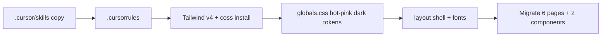

# Port sway-sched skills and migrate cv-web to coss

## Target

[cv/services/web](cv/services/web) (`cv-web`) inside [dtp-yui](https://github.com/oscoDOTblog/dtp-yui) — there is no separate `dtp-ui-cv` repo.

Today: Next 14 + React 18, CSS modules ([`globals.css`](cv/services/web/app/globals.css), [`ui.module.css`](cv/services/web/app/ui.module.css) ~660 lines), no Tailwind/coss, no Cursor skills.

Reference: [sway-sched](file:///Users/argo/Code/sway/sway-sched) — Tailwind v4 + `@base-ui/react` + coss primitives in `src/components/ui/*.tsx`, skills under `.cursor/skills/`.

## Approach (committed)

1. **Copy all three skills** into `dtp-yui/.cursor/skills/` (agent docs only).
2. **Add project rules** at `dtp-yui/.cursorrules` scoped to cv-web UI (Tailwind v4 + coss, pages/lib stay JS, ui primitives TSX, hot pink `#ff1493`).
3. **Upgrade cv-web** to Next 15+/React 19 (needed for current `@base-ui/react` + coss registry used by sway-sched) while keeping `output: "standalone"` for Docker.
4. **Install Tailwind v4 + coss runtime** in `cv/services/web` (not a CSS-module retheme).
5. **Migrate all pages** off CSS modules onto coss primitives + Tailwind; delete `ui.module.css` / `layout.module.css` when unused.
6. **Visual direction** (frontend-design, subject-grounded): keep Netflix-dark + hot pink; replace Segoe with a deliberate display/body pair (e.g. Geist or similar via `next/font`); signature = dense “ops console” header + pink score/status accents — not a marketing hero. App surfaces stay card-light; use Frame/Card only where interaction needs a container.

## 1. Cursor skills + rules

Copy from sway-sched (entire trees):

- `.cursor/skills/coss/` (including `references/`)
- `.cursor/skills/coss-particles/`
- `.cursor/skills/frontend-design/`

Add [`dtp-yui/.cursorrules`](dtp-yui/.cursorrules) adapted from sway-sched:

- Tailwind v4 + coss for all cv-web UI
- Primitives in `cv/services/web/components/ui/*.tsx`; pages/lib stay JavaScript
- Netflix dark + `#ff1493` via coss semantic tokens
- No credential leakage; camelCase for any new DB fields if touched

Skills live at **repo root** so Cursor agents pick them up for this workspace.

## 2. Runtime stack in `cv/services/web`

Keep App Router under `app/` (no forced move to `src/`). Add:

| Piece | Location |
|-------|----------|
| `components.json` | `@coss` registry, aliases `@/components`, `@/components/ui`, `@/lib/utils`; CSS path `app/globals.css` |
| `postcss.config.mjs` | `@tailwindcss/postcss` |
| `tsconfig.json` + update `jsconfig`/`paths` | Allow TSX ui + `@/` imports from JS pages |
| `lib/utils.ts` | `cn()` |
| `components/ui/*` | Install via `npx shadcn@latest add @coss/<name>` — start with: button, badge, card, frame, input, textarea, checkbox, tabs, alert, separator, spinner, empty, toast, table, field, label, select, switch |

Deps (mirror sway-sched UI set): `tailwindcss`, `@tailwindcss/postcss`, `postcss`, `@base-ui/react`, `class-variance-authority`, `clsx`, `tailwind-merge`, `lucide-react`, `shadcn`, `tw-animate-css`, plus TypeScript types.

**Theme:** Replace [`app/globals.css`](cv/services/web/app/globals.css) with sway-sched-style token block (`@import "tailwindcss"`, `tw-animate-css`, `shadcn/tailwind.css`, `@theme inline`, `.dark` Netflix grays, `--primary` / `--ring` ≈ hot pink `oklch(0.65 0.28 350)` + `--hot-pink: #ff1493`). Force `className="dark"` on `<html>`.

**Layout:** Rewrite [`app/layout.js`](cv/services/web/app/layout.js) with `next/font`, sticky nav using Button/link styles, `ToastProvider`, radial dark atmosphere background. Drop `layout.module.css`.

## 3. Page migration map

| Surface | File | coss mapping |
|---------|------|--------------|
| Inbox | [`app/page.js`](cv/services/web/app/page.js) | Card/Frame list, Badge for apply/consider/reject, Tabs or ToggleGroup for eligible filter, Checkbox bulk select, Button actions, Alert errors, Empty state |
| Job detail | [`app/jobs/[jobId]/page.js`](cv/services/web/app/jobs/[jobId]/page.js) | densest page — sections with Separator, Badge scores, Button approve flows |
| Analyze | [`app/analyze/page.js`](cv/services/web/app/analyze/page.js) | Form Field + Textarea/Input + Button |
| Gaps | [`app/gaps/page.js`](cv/services/web/app/gaps/page.js) | list + Badge/Alert |
| Applications | [`app/applications/page.js`](cv/services/web/app/applications/page.js) | Table or Card rows |
| Profile | [`app/profile/page.js`](cv/services/web/app/profile/page.js) | Field forms |
| Shared | [`DocumentPackagePanel.js`](cv/services/web/app/components/DocumentPackagePanel.js), [`LoadingGif.js`](cv/services/web/app/components/LoadingGif.js) | Tailwind; Spinner where appropriate |

Preserve all API/`lib` behavior — styling-only + structural markup for coss composition. No inventing coss APIs (follow skill refs under `.cursor/skills/coss/references/`).

## 4. Cleanup + verify

- Delete unused `*.module.css` once pages compile without them.
- `npm run build` in `cv/services/web`; fix Docker/standalone if Next major bumps need Dockerfile tweaks.
- Smoke: Inbox load, filter, ingest banner, job detail, profile save paths still call same `lib/api.js` helpers.

## Out of scope

- Backend API/worker/ingest changes
- Stage 2B Sources page (separate plan)
- Copying sway-sched sidebar/auth — cv-web stays local localhost shell
