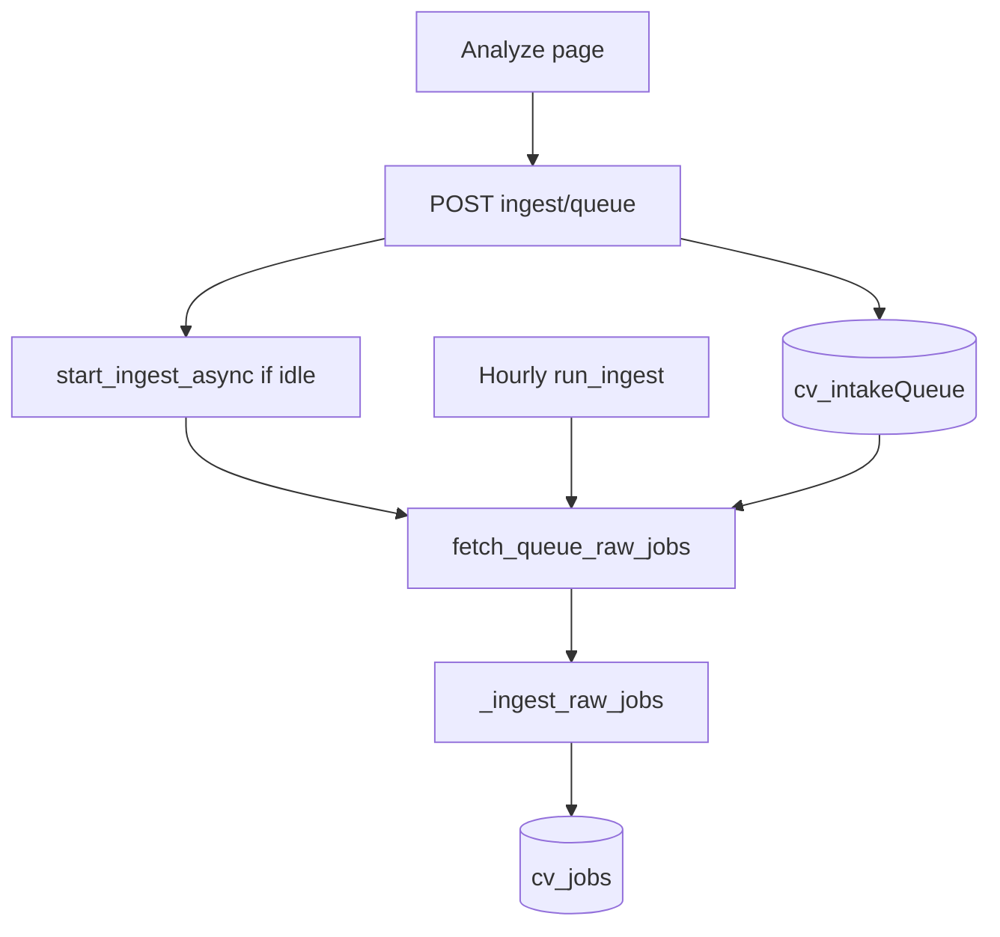

# Manual URL intake queue (Analyze → queue → ingest)

## Decisions (locked)

| Topic | Choice |
|---|---|
| UI | Extend **Analyze** — queue is the primary path (replace sync create→analyze→redirect) |
| Processing | Always enqueue; **kick async ingest if idle**, else wait for next `run_ingest` (hourly worker or Inbox “Fetch alerts”) |
| Multi-URL | Textarea accepts **one URL per line** (plus optional single pasted description attached to the first/only URL when page is blocked) |
| Pipeline | Drain via shared [`_ingest_raw_jobs`](cv/services/shared/cv_shared/intake/pipeline.py) (Bay Area gate, dedupe, auto-analyze) |
| Greenhouse URLs | If URL matches a single Greenhouse job page, fetch via boards API job-by-id and reuse `greenhouse_job_to_raw` externalIds so board polls and manual queue dedupe |
| Legacy `POST /jobs` | Keep for API compat; Analyze stops calling it |



---

## 1. Collection `cv_intakeQueue`

Add `INTAKE_QUEUE = "cv_intakeQueue"` in [`collections.py`](cv/services/shared/cv_shared/collections.py). Indexes in [`db.py`](cv/services/shared/cv_shared/db.py): `status`, `createdAt`, unique sparse on `url` for pending/processing only if practical — simpler: unique on normalized `url` is too strict after `done`; instead dedupe **pending** by URL at enqueue time (return existing pending id).

**Document shape:**

```json
{
  "_id": "iq_…",
  "url": "https://…",
  "descriptionRaw": null,
  "status": "pending",
  "error": null,
  "jobId": null,
  "fetchStatus": null,
  "createdAt": "ISO",
  "updatedAt": "ISO",
  "processedAt": null
}
```

Statuses: `pending` → `processing` → `done` | `failed` | `needsPaste`.

Document in [`COLLECTIONS.md`](cv/docs/COLLECTIONS.md).

---

## 2. Queue module + URL → raw job

New [`cv_shared/intake/manual_queue.py`](cv/services/shared/cv_shared/intake/manual_queue.py):

- `enqueue_urls(urls, descriptionRaw?)` — normalize/trim, skip blanks, upsert pending by URL, attach paste text when provided
- `list_queue(limit)` — recent items for UI
- `patch_queue_item(id, descriptionRaw)` — fill paste for `needsPaste` → back to `pending`
- `delete_queue_item(id)` — only if not `processing`
- `claim_pending(limit)` — atomic `find_one_and_update` pending→processing
- `mark_done` / `mark_failed` / `mark_needs_paste`

New [`cv_shared/intake/url_to_raw.py`](cv/services/shared/cv_shared/intake/url_to_raw.py) (or fold into manual_queue):

1. **Greenhouse single job** — parse `boards.greenhouse.io/{token}/jobs/{id}` (and `job-boards.greenhouse.io` variants) → `GET …/boards/{token}/jobs/{id}?content=true` → `greenhouse_job_to_raw` with `discoveredBy.source: "manual-queue"` (keep `source: "greenhouse"` + same `externalId` for dedupe; pipeline already skips enrich for greenhouse).
2. Else if `descriptionRaw` present → raw with `source: "manual"`, `externalId: manual:{hash}`, skip enrich.
3. Else → raw stub with `sourceUrl` / `url` only; `_ingest_raw_jobs` calls `enrich_raw_job`. If enrich blocked / empty → mark queue item `needsPaste` (do not create a hollow job).

---

## 3. Pipeline: drain queue on every ingest

In [`pipeline.py`](cv/services/shared/cv_shared/intake/pipeline.py):

- Accept `sources`: `all` | `gmail` | `greenhouse` | `manual` (extend validation).
- When `sources in ("all", "manual")`: claim pending → convert to raw → `_ingest_raw_jobs` with `count_prefix="manual"`; update queue rows with `jobId` / errors / `needsPaste`.
- Summary counters: `manualJobsCreated`, `manualJobsUpdated`, `queuePending`, `queueNeedsPaste`.
- Hourly worker already calls `run_ingest(analyze=True)` → `sources=all` → queue drains automatically.
- `start_ingest_async` / `POST /ingest/run` accept `sources=manual`.

Claim carefully under the existing single-flight ingest lock so two runs never process the same row.

---

## 4. API

In [`main.py`](cv/services/api/main.py):

| Method | Path | Behavior |
|---|---|---|
| `POST` | `/ingest/queue` | Body `{ urls: string[] \| string, descriptionRaw? }` → enqueue; if idle, `start_ingest_async(sources="manual")` (or `"all"` if you prefer sharing the run — prefer **`manual`** so a busy Gmail/GH run isn’t required); return `{ items, ingest: { accepted, conflict, runId } }` |
| `GET` | `/ingest/queue` | List recent queue items |
| `PATCH` | `/ingest/queue/{id}` | Attach `descriptionRaw` for `needsPaste` → `pending`; try kick ingest |
| `DELETE` | `/ingest/queue/{id}` | Cancel pending / failed / needsPaste |
| `POST` | `/ingest/queue/process` | Explicit “Process queue” → `start_ingest_async(sources="manual")` |

Reuse existing `/ingest/status` for progress polling.

---

## 5. Analyze UI

Rewrite [`analyze/page.js`](cv/services/web/app/analyze/page.js) (coss primitives already in place):

- Copy: “Queue job URLs for intake” — one URL per line.
- Primary CTA: **Queue for intake** (not Fetch & analyze).
- Optional: “Paste description instead” still available; when used with one URL, enqueue with `descriptionRaw`.
- On submit: `POST /ingest/queue` → show toast/alert: processing now **or** “Queued — ingest busy / will run on next cycle”.
- Below form: **Queue** list (status pills, error, link to `/jobs/{jobId}` when done, Paste action for `needsPaste`, Delete for cancel).
- Poll `GET /ingest/queue` + `/ingest/status` while a kick was accepted.
- Nav label can stay **Analyze** or become **Queue** — keep **Analyze** to avoid nav churn; update page H1 only.

Use coss `Alert`, `Button`, `Textarea`, `Badge`, `Spinner` per [`.cursor/skills/coss`](.cursor/skills/coss/SKILL.md).

---

## 6. Docs

- [`COLLECTIONS.md`](cv/docs/COLLECTIONS.md) — `cv_intakeQueue`
- [`ARCHITECTURE.md`](cv/docs/ARCHITECTURE.md) / [`ROADMAP.md`](cv/docs/ROADMAP.md) — manual URL queue as Analyze intake path
- Brief note that sync Analyze create path is superseded by queue

---

## Out of scope

- Lever/Ashby URL adapters (generic HTML enrich only)
- Playwright / login-walled Glassdoor page scrape
- Changing Gmail/Greenhouse Settings toggles
- Removing `POST /jobs` entirely

## Acceptance

- Paste 1–N URLs on Analyze → rows appear in queue as `pending`
- If no ingest running → queue drains, Bay Area-eligible jobs get matches; UI shows `done` + job link
- If ingest already running → items stay pending until that run finishes or the next hourly/`sources=all` run
- Blocked pages without paste → `needsPaste`; attaching description re-queues and processes
- Greenhouse job URL dedupes against an existing board-polled job (`externalId` match)
- Hourly worker drains leftover pending items without UI action
