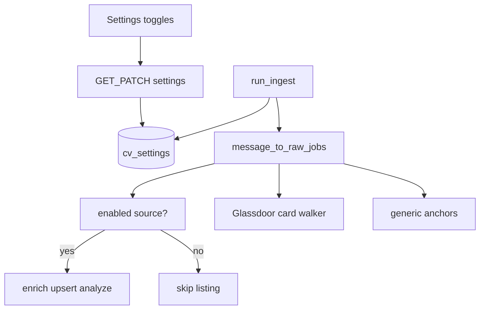

# Settings toggles + Glassdoor digest parser

## Problem

1. **Deep links / cards** — Glassdoor digests (screenshot: company + rating, title link, location, salary in separate table rows) do not match today’s anchor-first parser in [`gmail_source.py`](cv/services/shared/cv_shared/intake/gmail_source.py), so company becomes `Unknown`, URLs are weak/missing, and Open/enrich fail.
2. **No UI control** — Ingest source gating is only `GMAIL_QUERY` env + post-hoc `detect_alert_source` labels. No way to turn LinkedIn / Indeed / Glassdoor off from the app.

## Decisions (locked)

| Topic | Choice |
|---|---|
| Scope | Same plan: Settings + Glassdoor parser |
| Settings toggles | Gmail alert providers only (LinkedIn, Indeed, Glassdoor, Built In, Other). Greenhouse boards stay Stage 2B |
| Source of truth | Mongo `cv_settings` doc `_id: "app"` — UI writes via API; worker + `POST /ingest/run` read it. Env `GMAIL_QUERY` stays mailbox bootstrap only |
| Nav | New **Settings** tab (before Profile) |
| Toggle UX | CSS module switch/slider (new component; none exists today) |
| Glassdoor | Dedicated HTML card walker before generic anchors; persist salary; keep listing URL even when page fetch is blocked |



---

## 1. Mongo settings + API

Add `SETTINGS = "cv_settings"` in [`collections.py`](cv/services/shared/cv_shared/collections.py).

**Document shape:**

```json
{
  "_id": "app",
  "gmailIngest": {
    "linkedinEmail": true,
    "indeedEmail": true,
    "glassdoorEmail": true,
    "builtinEmail": true,
    "otherEmail": true
  },
  "updatedAt": "ISO-8601"
}
```

- Module [`cv_shared/settings.py`](cv/services/shared/cv_shared/settings.py): `get_app_settings()` (upsert defaults if missing), `patch_app_settings(partial)`, `is_gmail_source_enabled(alert_source)`.
- Map `detect_alert_source` values → keys: `linkedin-email` → `linkedinEmail`, `indeed-email` → `indeedEmail`, `glassdoor-email` → `glassdoorEmail`, `builtin-email` → `builtinEmail`; everything else → `otherEmail`.
- API: `GET /settings`, `PATCH /settings` with body `{ gmailIngest: { ...partial bools } }`. Never accept unknown keys; return full doc after patch.

Document in [`COLLECTIONS.md`](cv/docs/COLLECTIONS.md).

---

## 2. Gate ingest with Settings

In [`pipeline.py`](cv/services/shared/cv_shared/intake/pipeline.py) (and/or right after `message_to_raw_jobs`):

- Load settings once per run.
- For each raw job, read `discoveredBy.source` (or message-level alert source); if disabled, skip enrich/upsert/analyze and increment `summary.skippedDisabledSource`.
- Still mark the Gmail message processed when all its listings were skipped-by-toggle or successfully handled (avoid reprocessing forever). Do **not** mark processed if parse/upsert hard-failed (keep existing failure semantics).

Hourly worker and background API ingest both use `run_ingest` → same gate. No Docker restart needed for toggle changes.

---

## 3. Settings UI

- Nav: add Settings in [`layout.js`](cv/services/web/app/layout.js) before Profile.
- Page [`app/settings/page.js`](cv/services/web/app/settings/page.js): client page, load `GET /settings`, one row per provider with label + description + switch.
- New styles in [`ui.module.css`](cv/services/web/app/ui.module.css): `.switch` / `.switchTrack` / `.switchThumb` (hot-pink on, Netflix dark off). Instant optimistic toggle → `PATCH /settings`; rollback + error on failure.
- Copy: clarify these control **which alert senders are ingested**, not Gmail labels; mailbox still needs `JobAlerts` / `GMAIL_QUERY`.

---

## 4. Glassdoor digest card / deep-link parser

Extend [`gmail_source.py`](cv/services/shared/cv_shared/intake/gmail_source.py):

1. **`extract_glassdoor_listings(html_body)`** when From/HTML indicates Glassdoor:
   - Prefer job anchors whose href contains `glassdoor.com` + (`jobListing` / `job-listing` / `/Job/`); skip CTA text (`Easy Apply`, `Apply`, …).
   - **Company**: nearest preceding text/row; strip trailing `\d\.\d` + star glyphs → company name.
   - **Title**: non-CTA anchor text.
   - **Location**: following line matching `City, ST` / Remote / Hybrid / Bay Area.
   - **Salary**: `$…K` / range / `(Employer est.)` on following lines → `salary` on raw job (normalize already passes it through).
   - **URL**: cleaned href (peel nested `url|u|q|redirect|dest`); treat `partner/jobListing.htm` as jobish; use `jobListingId` in `externalId` when present for stable dedupe.

2. **Orchestration** in `extract_digest_listings`:
   - If Glassdoor walker returns listings → use them (do not early-return weak generic anchors that overwrite).
   - Else existing `_anchor_listings` / link fallback.
   - If generic anchors return company `Unknown` and Glassdoor walker also finds cards, prefer walker merge by URL/`jobListingId`.

3. **URL hardening**: `_clean_url` peel nested redirects; keep Glassdoor listing hosts; narrow noise so `"manage"` / `"job-alert"` do not drop `jobListing` paths.

4. Enrichment unchanged: best-effort fetch; on block keep card snippet + stored URL so **Open** still works in a real browser.

Optional: add one redacted HTML fixture under `cv/tests/fixtures/` + a small unit assert on company/title/url if easy; otherwise manual verify against a live Glassdoor digest.

---

## 5. Docs

- [`GMAIL_SETUP.md`](cv/docs/GMAIL_SETUP.md): Settings toggles + Glassdoor card parsing note.
- Brief README / COLLECTIONS mention of `cv_settings`.

## Out of scope

- Greenhouse / Lever Sources UI (Stage 2B plan)
- Playwright for login-walled Glassdoor pages
- Changing Telegram / Bay Area gate behavior

## Acceptance

- Settings tab shows switches; toggling Glassdoor off skips new Glassdoor listings on next ingest; toggling on resumes — no env edit / redeploy.
- API and worker agree (same Mongo doc).
- Glassdoor digest like the screenshot yields multiple jobs with real company names, titles, locations, salaries when present, and working Open URLs (`canonicalApplyUrl` / `url`).
- LinkedIn/Indeed paths unchanged when their toggles are on.
