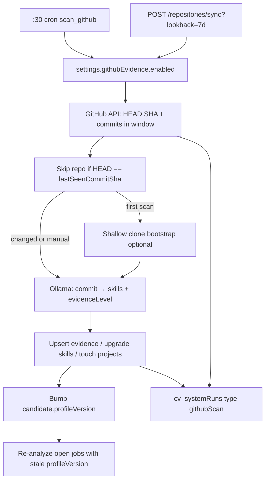

# Stage 4 — GitHub Evidence Engine

## Goal

Poll configured GitHub repos, turn recent commits into grounded skill/project evidence using the existing ladder (`mentioned` → `maintained`), bump `profileVersion` when the profile changes, and rescore open jobs. Operators can **manually Sync** with an explicit **lookback** window.

Mirror the Greenhouse control pattern: Settings master toggle + per-entity list page with run-now.

## Architecture



## Committed decisions

- **Auth:** classic/fine-grained PAT in [`cv/secrets/github-token`](cv/secrets/github-token) (file, gitignored); env `GITHUB_TOKEN_FILE` optional override. Same `SECRETS_DIR` pattern as Gmail.
- **Lookback presets (manual):** `1d` | `7d` | `30d` | `90d` | `365d` | `all`
- **Cron lookback:** commits since `lastSeenCommitSha` when present; otherwise default `7d`. Entire repo skipped when HEAD SHA equals `lastSeenCommitSha` (manual Sync never uses this skip — it always walks the selected window).
- **Already-scanned SHAs:** skip commits already in `cv_repositoryScans` unless `force=true`.
- **Author filter:** only commits by configured logins (seed: `oscoDOTblog` from candidate GitHub URL); stored on settings as `githubEvidence.authorLogins`.
- **Evidence writes:** create `cv_evidence` with `source: "github"` and `approvedForResume: false`; **monotonically upgrade** existing skill `evidenceLevel` only (never downgrade); never auto-flip `approvedForResume` to true.
- **New skills:** if Ollama proposes an unknown skill, insert with `approvedForResume: false` and low ladder floor (`implemented` max on first sighting unless signals justify higher).
- **Shallow clone:** only on first successful scan of a repo (or when API cannot list files) into `repository-cache/{owner}__{repo}` for bootstrap signals (languages, tests/, `.github/workflows`, package manifests) — not every cron.
- **Rescore:** re-run `analyze_job` for jobs that have a match with `profileVersion < candidate.profileVersion` and `status != "out_of_area"`.

## Data model

### `cv_settings` — extend app doc

```json
"githubEvidence": {
  "enabled": true,
  "authorLogins": ["oscoDOTblog"],
  "defaultLookback": "7d"
}
```

Extend [`settings.py`](cv/services/shared/cv_shared/settings.py) with get/patch helpers + `is_github_evidence_enabled()`.

### `cv_repositories` (seed + UI)

| Field | Purpose |
|---|---|
| `_id` | e.g. `repo_sway_f4` (matches existing `projects.repositoryIds`) |
| `fullName` | `owner/repo` |
| `defaultBranch` | e.g. `main` |
| `projectIds` | linked projects |
| `enabled` | per-repo toggle |
| `lastSeenCommitSha` | HEAD at last successful scan |
| `lastScannedAt` / `lastSuccessAt` / `lastError` | poll state |
| `lastCommitCount` | commits processed last run |
| `clonePath` | relative path under `repository-cache/` when cloned |

Seed file: [`cv/seed/repositories.json`](cv/seed/repositories.json) mapping dangling IDs from [`projects.json`](cv/seed/projects.json) to real `fullName`s. Seed upserts identity without wiping scan state (same as `seed_job_sources`).

### `cv_repositoryScans`

One doc per analyzed commit: `_id` = `{repoId}:{sha}`, plus `repositoryId`, `sha`, `committedAt`, `message`, `files[]`, `extracted` (skills/levels), `createdAt`.

### Indexes

Add in [`db.py`](cv/services/shared/cv_shared/db.py): `cv_repositories.enabled`, `cv_repositoryScans.repositoryId`, unique `_id` on scans.

## Backend modules

New package under shared (parallel to intake):

- [`cv/services/shared/cv_shared/github/client.py`](cv/services/shared/cv_shared/github/client.py) — PAT load, rate-limit aware REST (HEAD ref, compare/commits list, commit files)
- [`cv/services/shared/cv_shared/github/analyze.py`](cv/services/shared/cv_shared/github/analyze.py) — Ollama prompt (server-side) mapping commit message + paths → `{ skillName, evidenceLevel, claim }[]`; ladder clamp rules
- [`cv/services/shared/cv_shared/github/clone.py`](cv/services/shared/cv_shared/github/clone.py) — shallow clone / fetch into `repository-cache/`
- [`cv/services/shared/cv_shared/github/pipeline.py`](cv/services/shared/cv_shared/github/pipeline.py) — `run_github_scan(lookback=..., repository_ids=..., force=False)` + single-flight + `cv_systemRuns` (`type: "githubScan"`)

**Worker:** replace `stub_scan_github` in [`worker/main.py`](cv/services/worker/main.py) with real `run_github_scan(lookback=None)` (None = cron mode: SHA skip + since-last-sha / 7d).

**Profile bump:** helper `bump_profile_version()` increments `cv_candidates.profileVersion` (ignore env `PROFILE_VERSION` override for runtime bumps — env remains seed/bootstrap only; document that running with `PROFILE_VERSION` set freezes the stamped match version). Prefer: stamp matches from Mongo `candidate.profileVersion` only when env unset (already the case); bump Mongo on evidence writes.

## API routes ([`api/main.py`](cv/services/api/main.py))

| Route | Behavior |
|---|---|
| `GET /repositories` | List repos + scan fields |
| `POST /repositories` | Add repo (`fullName`, optional `projectIds`); probe GitHub API |
| `PATCH /repositories/{id}` | `enabled`, `projectIds`, etc. |
| `POST /repositories/sync` | Body/query: `lookback` (required), optional `repositoryIds[]`, `force` → async scan |
| `POST /repositories/{id}/sync` | Same for one repo |
| `GET /repositories/sync/status?runId=` | Poll `cv_systemRuns` |
| `GET/PATCH /settings` | Include `githubEvidence` |

Gate: if master disabled → 400 (same as Greenhouse poll).

## Web UI

### Settings ([`settings/page.js`](cv/services/web/app/settings/page.js))

New Switch card: **GitHub evidence** → `githubEvidence.enabled`. Description points to Repositories page.

### Repositories page (new [`app/repositories/page.js`](cv/services/web/app/repositories/page.js))

Sources-style layout (coss Switch / Button / Select / Badge / Alert):

- Banner when master toggle off
- Toolbar: **Lookback** Select (`1 day` … `All time`) + **Sync all** + optional Force checkbox
- Rows: fullName, enabled, last SHA (short), lastSuccessAt, lastError, lastCommitCount, per-row **Sync**
- Add-repo form: `owner/repo`

Nav link in [`layout.js`](cv/services/web/app/layout.js) next to Sources.

Use [`.cursor/skills/coss`](dtp-yui/.cursor/skills/coss/SKILL.md) + particles for Select / Switch patterns.

## Docs / env

- New [`cv/docs/GITHUB_SETUP.md`](cv/docs/GITHUB_SETUP.md) (PAT scopes, secrets file, lookback semantics, Settings + Repositories)
- Update [`ROADMAP.md`](cv/docs/ROADMAP.md) Stage 4 → current/done when shipped; [`COLLECTIONS.md`](cv/docs/COLLECTIONS.md) schemas; [`secrets/README.md`](cv/secrets/README.md); [`.env.example`](cv/.env.example) (`GITHUB_TOKEN_FILE`, optional `GITHUB_SCAN_ON_START`)

## Out of scope (Stage 4)

- Auto `approvedForResume: true`
- GitHub App JWT (PAT first)
- LinkedIn / unrelated intake work
- Live PR review / Actions log scraping beyond commit + path + bootstrap clone signals
- Stage 3 logistics scoring (independent)

## Implementation order

1. Settings + collections + seed repositories + indexes
2. GitHub client + scan pipeline (SHA skip, lookback, scans collection) without Ollama (log commits only) — smoke-testable
3. Ollama analyze + evidence/skill/project writes + profile bump + rescore
4. Optional shallow-clone bootstrap
5. API routes + worker wire-up
6. Repositories UI + Settings toggle
7. Docs + seed fullNames for known `repo_*` IDs
