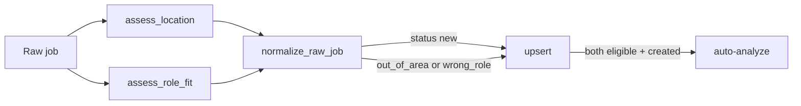

# SWE / SWE-adjacent title intake gate

## Goal

Stop non-engineering Greenhouse/Gmail noise from auto-analyzing into Inbox, using the same pattern as the Bay Area gate: config-driven → assess → status → skip auto-analyze.

## Approach (locked)

| Topic | Choice |
|---|---|
| Scope | Shared gate for **all** intake (Gmail, Greenhouse, manual queue normalize) — not Greenhouse-only |
| Matching | Title-primary; light description boost only if title is ambiguous (`Engineer` alone) |
| Policy | **Allowlist** of SWE / adjacent title patterns; **blocklist** always wins (recruiter, AE, CS, marketing, etc.) |
| Persistence | Upsert with `status: "wrong_role"` (parallel to `out_of_area`); do not drop silently |
| Auto-analyze | Only if `bayAreaEligible` **and** `roleEligible` |
| Manual Analyze | Unchanged — `POST /jobs/{id}/analyze` still works on wrong_role jobs |
| UI | Inbox default “Eligible” = location + role; chip for Wrong role; filter chip |
| Config | New [`cv/config/roleFilter.json`](cv/config/roleFilter.json) + `reload_role_filter_config()` (same cache pattern as location) |



Seed allowlist from your preferred roles + common eng titles: software / SWE / full-stack / frontend / backend / platform / systems / devops / SRE / mobile / iOS / Android / ML / AI / data engineer / staff / principal / founding / solutions / forward deployed / product engineer / security / cloud / infrastructure.

Blocklist examples: recruiter, talent acquisition, account executive, customer success, marketing, sales (except sales/solutions engineer handled via allow), product manager, product owner, nurse, attorney, designer (pure), finance, HR.

---

## 1. Config + assessor

**New** [`cv/config/roleFilter.json`](cv/config/roleFilter.json):

```json
{
  "includeTitlePatterns": ["software engineer", "software developer", "swe", "..."],
  "excludeTitlePatterns": ["recruiter", "account executive", "..."],
  "includeDescriptionPatterns": ["software engineer", "full-stack"]
}
```

**New** [`cv/services/shared/cv_shared/intake/role_filter.py`](cv/services/shared/cv_shared/intake/role_filter.py):

- `load_role_filter_config()` / `reload_role_filter_config()` (`lru_cache` + `cache_clear`)
- `assess_role_fit(*, title, description) -> dict`:

```json
{
  "roleEligible": true,
  "matchedIncludes": ["software engineer"],
  "matchedExcludes": [],
  "confidence": 0.9,
  "evidence": ["title matches software engineer"]
}
```

Logic:

1. Lowercase title (and short description snippet)
2. If any exclude pattern matches title → `roleEligible: false`
3. Else if any include pattern matches title → `true`
4. Else if title is thin/ambiguous (`engineer`, `developer` alone) and description hits include → `true` (lower confidence)
5. Else → `false`

Keep patterns as substring match (same style as location cities); document that operators edit JSON and restart/reload.

Wire `_DEFAULT_CONFIG` fallback in the module (mirror location.py).

---

## 2. Normalize + upsert + ingest

Update [`normalize.py`](cv/services/shared/cv_shared/intake/normalize.py):

- Call `assess_role_fit` (unless `raw.roleAssessment` already set)
- Attach `roleAssessment` on the job doc
- Status precedence: if not location eligible → `out_of_area`; else if not role eligible → `wrong_role`; else `new`

Update [`upsert.py`](cv/services/shared/cv_shared/intake/upsert.py): treat `wrong_role` like `out_of_area` when refreshing status on existing `new`/`out_of_area`/`wrong_role` docs (do not reopen analyzed jobs).

Update [`pipeline.py`](cv/services/shared/cv_shared/intake/pipeline.py) auto-analyze gate:

```python
eligible = (
  job.get("locationAssessment", {}).get("bayAreaEligible")
  and job.get("roleAssessment", {}).get("roleEligible")
)
# skip when status in (out_of_area, wrong_role)
```

Summary counter: `wrongRole` (alongside `outOfArea`).

---

## 3. API + Inbox UI

[`GET /jobs`](cv/services/api/main.py):

- Keep `eligible=true|false` for location
- Add `roleEligible=true|false` and/or composite `applyReady=true` meaning both gates pass
- Composite used by Inbox default: `applyReady=true` (or server-side: `eligible=true` redefined — **prefer new `applyReady`** to avoid breaking location-only views)

Inbox ([`page.js`](cv/services/web/app/page.js)):

- Filters: **Apply-ready** (default) / Bay Area only / Wrong role / Out of area / All
- Badge when `status === "wrong_role"` or `roleAssessment.roleEligible === false`
- Job detail can show `roleAssessment.evidence` briefly if already showing location chips

---

## 4. Docs

- [`COLLECTIONS.md`](cv/docs/COLLECTIONS.md): `roleAssessment`, status `wrong_role`
- [`ARCHITECTURE.md`](cv/docs/ARCHITECTURE.md): title gate beside location gate
- Short section in [`GREENHOUSE_SETUP.md`](cv/docs/GREENHOUSE_SETUP.md) or new note in README: edit `config/roleFilter.json`

## Out of scope

- Settings UI for editing patterns
- LLM title classification
- Changing match scores / roleFamily detection (still used at analyze time)

## Acceptance

- Greenhouse “Account Executive, SF” → upserted `wrong_role`, not auto-analyzed
- “Senior Software Engineer, Remote” → apply-ready (if location ok) and auto-analyzed
- “Staff Platform Engineer, San Jose” → eligible
- “Recruiter” / “Product Manager” → wrong_role
- Gmail same rules; manual Analyze still works on wrong_role jobs
- Editing `roleFilter.json` + restart/reload changes the gate
