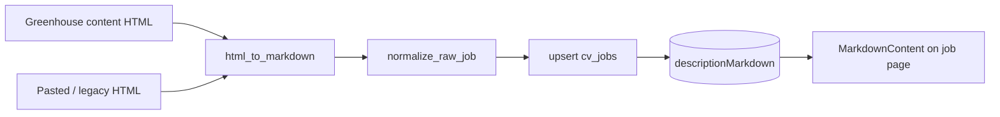

# Reformat job descriptions into rendered markdown

## Problem

Some jobs store literal HTML in `descriptionRaw` (e.g. `<h2>`, `
`, `<ul><li>`, `<a href>` — the Stripe example). The job page renders it verbatim in a `<pre>` at [cv/services/web/app/jobs/[jobId]/page.js](cv/services/web/app/jobs/[jobId]/page.js) lines 439-447, so tags show as text. Intake elsewhere flattens HTML to tag-free plain text via two `html_to_text` helpers, losing headings/lists.

## Approach

Convert structured HTML to markdown **server-side** at intake, store it in a new `descriptionMarkdown` field (leave `descriptionRaw` as plain text so matching/documents/hashing are unchanged), and render markdown in the UI with a fallback to `descriptionRaw`.

## 1. Server: HTML to markdown converter (no new Python dep)

New module `cv/services/shared/cv_shared/intake/html_markdown.py`, an `HTMLParser` subclass mirroring the existing `_HTMLToText` in [greenhouse_source.py](cv/services/shared/cv_shared/intake/greenhouse_source.py):
- `h1..h4` -> `#`..`####`; `
` -> blank-line-separated blocks
- `<ul><li>` -> `- `; `<ol><li>` -> `1. ` (track list type/depth)
- `<strong>/<b>` -> `**`, `<em>/<i>` -> `*`, `<a href>` -> `[text](href)`, ` ` -> newline
- skip `script/style`, `html.unescape`, collapse 3+ blank lines
- helper `looks_like_html(text)` (regex for `</?(p|div|ul|li|h[1-6]|a|br|strong|em)\b`) to decide when to convert vs pass through

## 2. Populate `descriptionMarkdown` at intake (clean-HTML sources only)

- [greenhouse_source.py](cv/services/shared/cv_shared/intake/greenhouse_source.py) `greenhouse_job_to_raw`: set `descriptionMarkdown = html_to_markdown(content_html)` next to the existing `descriptionRaw = html_to_text(content_html)`.
- [url_to_raw.py](cv/services/shared/cv_shared/intake/url_to_raw.py) paste path and [main.py](cv/services/api/main.py) legacy `POST /jobs`: if the pasted/fetched body `looks_like_html`, set `descriptionMarkdown = html_to_markdown(...)` and keep `descriptionRaw` as the `html_to_text` plain version.
- Generic listing enrich in [fetch_listing.py](cv/services/shared/cv_shared/intake/fetch_listing.py) stays plain text (full-page HTML is chrome-heavy); those jobs get no markdown and fall back to `descriptionRaw` at render.

## 3. Carry the field through normalize + upsert

- [normalize.py](cv/services/shared/cv_shared/intake/normalize.py): add `"descriptionMarkdown": (raw.get("descriptionMarkdown") or "").strip() or None` to the returned dict. `descriptionRaw` logic unchanged.
- [upsert.py](cv/services/shared/cv_shared/intake/upsert.py): include `descriptionMarkdown` in the insert `doc` and, on update, set it when the incoming value is present and longer than the existing one (same rule used for `descriptionRaw`).

## 4. Backfill existing jobs

New `cv/services/worker/scripts/backfill_description_markdown.py` (run once): for each `cv_jobs` doc missing `descriptionMarkdown`, if `descriptionRaw` `looks_like_html` -> set `descriptionMarkdown = html_to_markdown(descriptionRaw)` and rewrite `descriptionRaw = html_to_text(descriptionRaw)`; otherwise set `descriptionMarkdown = descriptionRaw` (already plain, renders fine). Fixes the current Stripe-style jobs.

## 5. UI: render markdown

- Add deps in [cv/services/web/package.json](cv/services/web/package.json): `react-markdown` and `remark-gfm`.
- New reusable JS component `cv/services/web/app/components/MarkdownContent.js` wrapping `ReactMarkdown` with `remarkPlugins={[remarkGfm]}` and a `components` map applying Tailwind classes for the dark theme: `h2/h3` semibold with spacing, `ul/ol` with `list-disc/list-decimal pl-5`, `li` spacing, `p` `leading-relaxed`, `a` `text-[#ff1493] underline` + `target="_blank" rel="noreferrer"`.
- In [cv/services/web/app/jobs/[jobId]/page.js](cv/services/web/app/jobs/[jobId]/page.js), replace the `<pre>{job.descriptionRaw}</pre>` (lines 439-447) with `<MarkdownContent content={job.descriptionMarkdown || job.descriptionRaw} />`. The generic `_serialize` in [main.py](cv/services/api/main.py) already passes new fields through, so no API read change is needed.

## 6. Docs

- [cv/docs/COLLECTIONS.md](cv/docs/COLLECTIONS.md): document `descriptionMarkdown` on `cv_jobs` and note `descriptionRaw` remains the plain-text field used for matching/documents.

## Out of scope

- Content extraction / de-chroming of full generic listing pages (Glassdoor/Indeed keep plain text).
- Re-running matching or regenerating documents (they already use plain `descriptionRaw`).

## Acceptance

- Stripe-style HTML jobs render as headings + bullet lists with clickable links, no raw tags.
- New Greenhouse intakes store both `descriptionMarkdown` and plain `descriptionRaw`.
- Jobs without markdown still render via `descriptionRaw` fallback.
- Backfill converts existing HTML-in-`descriptionRaw` jobs.