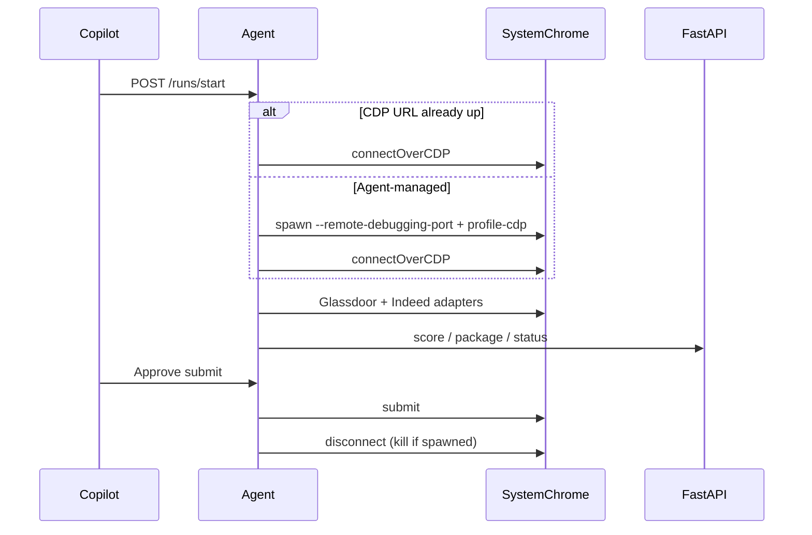

# CDP attach to system Chrome

## Goal

Stop launching Chrome through Playwright’s `launchPersistentContext` (which injects automation defaults). Instead: start or attach to **branded Google Chrome** with `--remote-debugging-port`, then control it via `chromium.connectOverCDP`. Existing Indeed/Glassdoor adapters, Copilot preview, human takeover, and submit approval stay as-is.

## Design choices (locked)

- **Primary mode for Chromium:** `CV_AGENT_BROWSER_MODE=cdp` (default when `CV_AGENT_BROWSER=chromium`).
- **Agent-managed Chrome:** spawn system Chrome via `child_process` with a **dedicated** user-data-dir (`browser-profile-cdp`), not the user’s daily Chrome profile.
- **Also support attach-only:** if `CV_AGENT_CDP_URL` is already serving DevTools, connect without spawning.
- **Cleanup:** if the agent spawned Chrome, disconnect on run end and kill that process; if attach-only, disconnect only (never quit the user’s browser).
- **Firefox / legacy launch:** keep `launchPersistentContext` when `CV_AGENT_BROWSER=firefox` or `CV_AGENT_BROWSER_MODE=launch`.



## Implementation

### 1. Browser launch layer — [`cv/services/agent/src/browser.js`](cv/services/agent/src/browser.js)

Add:

- `resolveBrowserMode()` → `cdp` | `launch` from `CV_AGENT_BROWSER_MODE` (default `cdp` for chromium, `launch` for firefox).
- `resolveCdpEndpoint()` → `CV_AGENT_CDP_URL` or `http://127.0.0.1:${CV_AGENT_CDP_PORT||9222}`.
- `spawnChromeForCdp({ executablePath, userDataDir, port })` — minimal args only:
  - `--remote-debugging-port=<port>`
  - `--user-data-dir=<browser-profile-cdp>`
  - `--no-first-run` / `--no-default-browser-check` (benign)
  - **Do not** pass Playwright’s automation flags or `--disable-blink-features=AutomationControlled`
- `connectCdpBrowser(endpoint)` → `chromium.connectOverCDP(endpoint)`, return `{ browser, context, page, spawnedPid?, ownedProcess }`.
- Wait/retry (~15s) for DevTools `/json/version` before connect.
- Refactor `launchBrowser()` to return a **handle** (or keep returning `context` but stash browser/process on a weak map / module state) so runner can disconnect correctly.

Suggested return shape (cleanest for runner):

```js
{
  context,          // BrowserContext (default context from CDP)
  page,             // first page or new page
  mode: "cdp"|"launch",
  async close()     // disconnect; kill spawned Chrome if owned
}
```

Reuse existing `resolveChromeExecutablePath()` for the spawn binary.

### 2. Runner wiring — [`cv/services/agent/src/runner.js`](cv/services/agent/src/runner.js)

- Replace `context = await launchBrowser(...)` with handle usage.
- `humanTakeover.install(context)` and `preview.start(page)` unchanged.
- On run finally: call `handle.close()` instead of bare `context.close()` (CDP `context.close()` / `browser.close()` would quit Chrome incorrectly for attach-only).
- Surface mode in run config / status (`browserMode: "cdp"`, `cdpEndpoint`).

### 3. Config / env

Update [`cv/services/agent/.env`](cv/services/agent/.env) and [`.env.example`](cv/services/agent/.env.example):

```bash
CV_AGENT_BROWSER=chromium
CV_AGENT_BROWSER_MODE=cdp
CV_AGENT_CDP_PORT=9222
# Optional: attach to an already-running Chrome instead of spawning
# CV_AGENT_CDP_URL=http://127.0.0.1:9222
CV_AGENT_CHROME_EXECUTABLE=/Applications/Google Chrome.app/Contents/MacOS/Google Chrome
```

Profile dir: `browser-profile-cdp` under the agent service (sibling of current `browser-profile`). Override via `CV_AGENT_CDP_PROFILE_DIR` if needed.

Expose `browserMode` + `cdpEndpoint` on `/health` in [`index.js`](cv/services/agent/src/index.js).

### 4. Preview / takeover

- [`preview.js`](cv/services/agent/src/preview.js): no API change expected; CDP screencast should work better on real Chromium CDP sessions. Keep screenshot poll fallback.
- [`humanTakeover.js`](cv/services/agent/src/humanTakeover.js): keep `exposeBinding` + init script on the CDP default context; verify once against a connected session (bindings can be flaky if pages existed before install — install before navigation / also re-bind on `context.on('page')` if needed).

### 5. Docs

Update [`cv/docs/AGENT_SETUP.md`](cv/docs/AGENT_SETUP.md) and a short note in [`cv/docs/ARCHITECTURE.md`](cv/docs/ARCHITECTURE.md):

- Default host flow: agent spawns Chrome + CDP attach.
- Manual attach: quit other Chrome using that profile, start once with debugging, set `CV_AGENT_CDP_URL`.
- Warn: never point `user-data-dir` at the live daily Chrome profile while that Chrome is open.
- Cloudflare: complete challenge in the Chrome window → Resume in Copilot (unchanged policy — no CAPTCHA bypass).

### 6. Out of scope

- OpenClaw / BrowserClaw
- Sharing the user’s daily Chrome cookies/profile
- Rewriting Indeed/Glassdoor adapters
- Docker headless-agent CDP (host-only for this pass)

## Acceptance checks

1. Agent log shows `browserMode=cdp` and connects to `127.0.0.1:9222` (or configured URL).
2. Spawned Chrome `chrome://version` Executable Path is `/Applications/Google Chrome.app/...` (not Chrome for Testing).
3. No yellow “unsupported command-line flag” bar from agent-added flags.
4. Copilot live preview still streams.
5. Click in Chrome still auto-pauses (takeover).
6. Easy Apply happy path still reaches Approve submit.
7. Attach-only mode: setting `CV_AGENT_CDP_URL` to a pre-started Chrome works; stopping the run does not quit that Chrome.

## Effort

~2–4 days focused work (spawn/connect/lifecycle + runner close semantics + docs/verify), within the ~1 week short-term window including Cloudflare soak testing.
