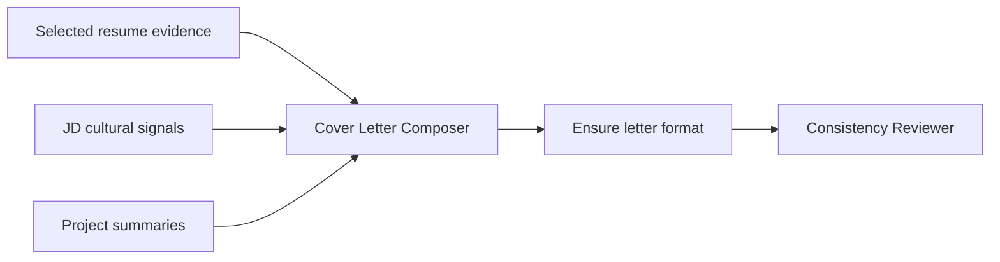

# Elevate cover letter voice and format

## Diagnosis

Your current letter is what the multi-stage composer is steered to produce today—not a formatting bug.

| Desired letter | Current letter | Causes |
|----------------|----------------|--------|
| Full business letter (date, recipient lines, salutation, sign-off) | Often starts mid-letter at “Dear Hiring Team” | System/user prompts do not mandate letterhead blocks |
| Motivation first (“platforms that unlock other engineers”) | Role + Capital One pedigree dump | Prompt prioritizes evidence transfer, not why-this-work |
| Elevated CapOne arc (scale, ownership, DX/reliability) | Bullet-to-prose + title progression + tech lists | User prompt dumps `rewrittenAchievements` JSON; model inventories them |
| Independent work as career direction | Weak or missing projects paragraph | Projects passed thinly; model stays in employment-only mode |
| Company why = leverage of DevInfra / culture grounded in JD | One generic team sentence | `COVER_LETTER_SYSTEM` allows company section but does not push multi-paragraph interpretation |
| Warm close (“Thank you… Sincerely”) | Thin closing | Structure step 5 is under-specified |

Key files: [`cv/services/shared/cv_shared/package/prompts.py`](cv/services/shared/cv_shared/package/prompts.py) (`COVER_LETTER_SYSTEM`, `CONSISTENCY_SYSTEM`), [`cv/services/shared/cv_shared/package/cover_letter.py`](cv/services/shared/cv_shared/package/cover_letter.py) (user prompt, temp, fallback).

Grounding stays: no inventing employers, metrics, or tech not in supplied material. The desired Coinbase letter’s *tone and shape* are the target; any claims must still be supportable from Mongo career bank/projects/JD only (e.g. do not invent “hundreds of engineers” or on-call if not in evidence).

## Approach

Prompt + light post-processing only. No new LLM stages. Both OpenAI multi-stage and simple path use `build_cover_letter`, so one change covers both.



### 1. Rewrite `COVER_LETTER_SYSTEM`

Replace the short goal list with a **narrative cover letter brief** that matches your target shape:

**Mandatory output format (plain text):**
```text
{Month D, YYYY}

Hiring Team
{Company}

Dear Hiring Team,

{body paragraphs}

I'd welcome the opportunity...

Thank you for your time and consideration. I look forward to the opportunity to speak with you.

Sincerely,

{Candidate Name}
```

**Paragraph plan (5–6 short paragraphs, ~400–550 words max for one page):**
1. **Opening** — Exact role + company; specific *motivation* for this kind of work (platform leverage / developer enablement for Infra/Platform roles; product ownership for product roles). No “I am writing to express my interest.” First person contractions OK (`I'm`, `I've`).
2. **Professional arc** — 1 paragraph: tenure, domain, *themes* (internal platforms, reliability, CI/CD, observability). **Interpret** experience; do **not** restate resume bullets, career title ladder, or dump 6+ tools.
3. **Independent / differentiator** — Only if projects supplied: initiative + direction, high-level stack only if in source.
4. **Why this company + role** — Map JD themes (team mission, developer impact, scale, reliability) to candidate strengths. No “innovative industry leader.”
5. **Culture fit** (when JD has signals) — Ownership, production-first, bar height, collaboration—only if supported or mild read of culturalSignals. Skip if empty.
6. **Close** — Soft ask + thanks + Sincerely + name.

**Anti-patterns (hard rules):**
- No bullet lists, match scores, or “Relevant evidence:”
- No packing paragraph with 5+ tool names
- No promotion chronology as the hook
- No copying resume bullets almost verbatim
- Prefer one concrete CapOne *system story class* over laundry lists

### 2. Rewrite cover user prompt in `cover_letter.py`

Change framing from inventory dump to composition brief:

- Instruct: “Write a full business letter in the format above. Evidence is for grounding only—tell a coherent career story.”
- Pass **slim** work context: employer, title, date range, **2–4 top** selected achievements as notes (not full JSON dump of 14).
- Pass **projects** with name + summary + `resumeBullets[:2]` when selected.
- Pass analysis: positioning, interview deciders, cultural signals, primary responsibilities (themes).
- Pass JD excerpt (keep ~2–2.5k for company language).
- Explicit: “Today’s date: {…}; recipient = Hiring Team / {company}.”
- Remove match score from model-facing text (or bury as “do not mention”).
- Temperature **0.45** (from 0.3) for natural voice under OpenAI.

### 3. Post-process letter envelope

In `cover_letter.py` after LLM (and for fallback):

- `_ensure_letter_envelope(text, candidate, job, date)` if output lacks a date line / “Sincerely” block, prepend date + Hiring Team / company and append standard sign-off without rewriting body.
- Keep `_strip_fences`.

### 4. Soften consistency gate for style

Update `CONSISTENCY_SYSTEM` so it:
- Still flags unsupported employers/tech/metrics and resume↔cover near-duplicates
- Does **not** “neutralize” first-person motivation or culture language grounded in the JD
- Prefer fixing inventory-style / bullet-pasty sentences over stripping personality

If critic would shorten letter below ~300 words by over-pruning, keep original when flags are only low-severity style nits.

### 5. Fallback template

Make `fallback_cover` match the same letter envelope and multi-paragraph skeleton (generic but structured) so Ollama-failure path does not look like a claim bullet list.

### 6. Docs touch

One paragraph in [`cv/docs/RESUME_PIPELINE.md`](cv/docs/RESUME_PIPELINE.md): cover goal is narrative business letter, not resume prose dump.

## Out of scope

- New multi-agent cover-only stages (composer + format + existing consistency is enough)
- Letting the model invent CapOne team sizes or Coinbase culture facts not in JD
- Changing DOCX/PDF layout beyond using the plain-text paragraphs already rendered

## Success criteria (manual smoke)

Regenerate a Coinbase Developer Infrastructure package with OpenAI on. Cover text should:
1. Start with date + Hiring Team / Coinbase
2. Open with motivation + exact role
3. CapOne paragraph without tool laundry list or title ladder as centerpiece
4. Mention independent/platform work if projects selected for the package
5. End with Thank you + Sincerely + name
6. Remain fact-bound to seed evidence + JD
