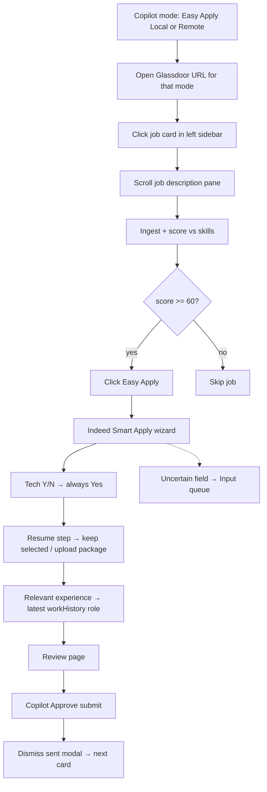

# Easy Apply streamline

## Target flow



Human **Approve submit** stays required. Capital One prefill comes from **latest seeded `cv_workHistory` role** (by `startDate` → Principal Associate Software Engineer @ Capital One).

## 1. Config — four URL slots + apply mode

Replace the binary `preferRemote` / dual-URL setup with an explicit mode in [`cv/config/agent.json`](cv/config/agent.json) and [`config.js`](cv/services/agent/src/config.js):

```json
{
  "applyMode": "easyApplyLocal",
  "searchUrls": {
    "easyApplyLocal": "<paste Glassdoor Easy Apply + local/hybrid filters>",
    "easyApplyRemote": "<paste Glassdoor Easy Apply + remote-only filters>",
    "companyApplyLocal": "",
    "companyApplyRemote": ""
  },
  "minimumScore": 60,
  "requireApprovalBeforeSubmit": true
}
```

| Mode id | Label in UI | Enabled now |
|---|---|---|
| `easyApplyLocal` | Easy Apply (Local) | yes |
| `easyApplyRemote` | Easy Apply (Remote) | yes |
| `companyApplyLocal` | Company Apply (Local) | **disabled** (no flow yet) |
| `companyApplyRemote` | Company Apply (Remote) | **disabled** (no flow yet) |

- `resolveSearchUrl(cfg)` returns `cfg.searchUrls[cfg.applyMode]` (fallback empty → build keyword URL as today)
- Keep legacy `searchUrl` / `searchUrlRemote` / `preferRemote` as read fallbacks when migrating so existing files still work once
- You paste the filtered Glassdoor URLs into the two Easy Apply slots (no programmatic filter clicking)
- Prefer Easy Apply cards in [`listResultCards`](cv/services/agent/src/glassdoor/search.js) when mode is Easy Apply

Persist mode for the run: `POST /runs/start` body may include `{ applyMode }`; runner writes it into the run config. Optional: `PATCH`-style agent config endpoint later — for MVP, Copilot sends `applyMode` on start and agent resolves URL from `agent.json` slots (URLs stay file-based until you ask for editable URL fields in UI).

## 2. Copilot settings component (new)

Add [`cv/services/web/app/components/CopilotSettings.js`](cv/services/web/app/components/CopilotSettings.js) and mount it on [`copilot/page.js`](cv/services/web/app/copilot/page.js) above the start controls.

- coss **ToggleGroup** (single select) with four options
- Easy Apply Local / Remote: selectable
- Company Apply Local / Remote: rendered but **`disabled`** with short helper text (“Coming soon”)
- Default selection: `easyApplyLocal`
- Disabled while a run is `running`
- Selected mode passed as `{ applyMode }` on **Start Glassdoor run**
- Show resolved mode badge in the status row (e.g. `mode: Easy Apply · Local`)

No Company Apply runner path in this pass — selecting those is impossible via disabled UI.

## 3. Glassdoor listing behavior

In [`glassdoor/search.js`](cv/services/agent/src/glassdoor/search.js):

- After opening a card, **scroll the right-hand job description** pane so scoring sees full JD content
- `clickApply`: prefer **Easy Apply** selectors first
- Set `easyApply: true` when the listing button is Easy Apply or apply lands on `smartapply.indeed.com`

## 4. Indeed Smart Apply adapter (new)

Today Easy Apply falls through to **generic** and there is no `smartapply.indeed.com` detection.

| File | Role |
|---|---|
| [`ats/detect.js`](cv/services/agent/src/ats/detect.js) | Detect Smart Apply / Indeed apply → `AtsType.INDEED_SMARTAPPLY` |
| [`ats/indeedSmartApply.js`](cv/services/agent/src/ats/indeedSmartApply.js) **new** | Step machine for the screenshot flow |
| [`ats/index.js`](cv/services/agent/src/ats/index.js) | Wire adapter |

Wizard steps:

1. **qualification-questions-module** — tech Yes/No → **Yes** + `DECISION_MADE` (`tech_default_yes`); legal/demographic → ASK_USER
2. **resume-selection-module** — keep selected resume or upload package
3. **relevant-experience** — Job title + Company from latest work history
4. **review-module** — wait for Copilot Approve submit → Submit
5. Post-submit — dismiss “Your application was sent” modal → return to results

Unknown modules / free-text with no safe default → Input queue.

## 5. Latest work role from seed

Extend [`candidate_agent_profile()`](cv/services/shared/cv_shared/agent_runs.py) with `latestRole: { title, company, startDate, endDate }` from `cv_workHistory` sorted by `startDate` desc. Runner loads `/agent/profile` and passes `profile.latestRole` into the Indeed adapter.

## 6. Policy: auto-Yes for technology questions

In [`policy.js`](cv/services/agent/src/policy.js):

- Tech/skill Yes-No → **AUTO_YES**
- LEGAL / sponsorship / salary / free-text / low-confidence → **ASK_USER**
- Auto-answered questions do not count against the ask budget

## 7. Runner wiring

In [`runner.js`](cv/services/agent/src/runner.js):

- Resolve URL from `applyMode` + `searchUrls`
- Score gate at `minimumScore` (60)
- Easy Apply modes → Indeed Smart Apply adapter when detected; Greenhouse/Lever/generic still available if an Easy Apply somehow lands external
- Company Apply modes: if somehow started, emit clear error / skip (“not implemented”) — UI prevents selection
- `awaitSubmissionApproval` before Submit; dismiss sent modal; continue card loop

## 7b. Do not re-apply (applied-job tracking)

Today `processCard` only skips when `applicationStatus` is `pending` or `apply` after ingest. Tighten that so Copilot never submits the same Glassdoor listing twice across runs:

- **Skip set:** treat any of `apply`, `pending`, `round1`–`round4`, `rejected` as already-handled for *agent apply* (do not Easy Apply again). Emit `DECISION_MADE` / SKIP with reason `already_applied` (or `already_tracked`) so the feed is clear
- **Stable identity:** keep upserting via `glassdoor:{sourceJobId}` / URL hash in [`ingest_glassdoor_job`](cv/services/shared/cv_shared/agent_runs.py) so the same listing merges onto one Mongo job
- **Mark promptly on success:** after submit confirmation (or `SUBMISSION_UNCERTAIN` if we still recorded a submit click), set `applicationStatus=pending` with note `Submitted via apply agent` (existing `setApplicationStatus` path) before moving to the next card
- **Optional early check:** if extract yields `sourceJobId`, query/lookup by external id before package generation so we skip without regenerating docs when already pending
- Copilot feed / Current job: show prior status when skipping (“Already applied / pending”)

## 8. Copilot feed

- Score APPLY/SKIP decisions visible in feed
- Auto-Yes decisions logged, not queued
- Uncertain / legal still in Input queue
- Badge for current apply mode

## 9. Docs

Update [`AGENT_SETUP.md`](cv/docs/AGENT_SETUP.md) / Architecture: Copilot mode picker, four URL slots, Easy Apply flow, score 60, tech auto-Yes, latest role prefill, human approve.

## Out of scope (this pass)

- Company Apply (Local/Remote) automation flow (UI stubs only)
- Editable URL fields in Copilot UI (URLs live in `agent.json` for now)
- Auto-submit without approval
- Programmatic Glassdoor filter clicks
- Cover letter / supporting documents
- Workday redesign
