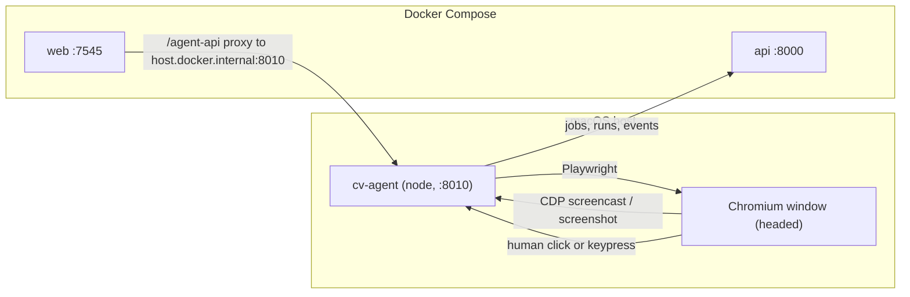

_

## Why the topology changes

A visible Chromium window can only come from the agent process running on macOS — the Linux container has no display. Today `cv/.env` already points web at `http://host.docker.internal:8010`, but Compose still publishes the containerized agent on `127.0.0.1:8010`, so that hostname loops straight back into the container. That is why `agent-1` served your last run. Parking the container agent behind a Docker profile frees the port for the host process.

Preview is unaffected by headed mode: CDP `Page.startScreencast` works in a headed window, and the existing screenshot fallback in [cv/services/agent/src/preview.js](cv/services/agent/src/preview.js) works regardless.



## 1. Make the headed window usable — [cv/services/agent/src/browser.js](cv/services/agent/src/browser.js)

`launchBrowser` currently forces `viewport: { width: 1440, height: 1000 }`, which in headed mode leaves the page viewport mismatched with the real OS window. Add a `headed` branch:

- headed: `viewport: null` plus args `--window-size=1440,1000` and `--window-position=40,40` so the page fills the actual window you click in.
- both modes: add `--disable-backgrounding-occluded-windows`, `--disable-renderer-backgrounding`, `--disable-features=CalculateNativeWinOcclusion` so Chromium keeps rendering (and keeps emitting screencast frames) when the window is behind the dashboard.
- export a `canUseHeadedDisplay()` guard returning false when `process.platform === "linux" && !process.env.DISPLAY`, so a headed request inside a container degrades to headless with a warning event instead of crashing the run.

## 2. Headed as a per-run choice — [cv/services/agent/src/runner.js](cv/services/agent/src/runner.js), [cv/services/agent/src/index.js](cv/services/agent/src/index.js)

`start()` currently hardcodes the env value:

```499:546:cv/services/agent/src/runner.js
    const cfg = { ...(await loadAgentConfig()), ...overrides };
      context = await launchBrowser({
        headless: envConfig().headless,
```

Resolve `headed` from `overrides.headed ?? !envConfig().headless`, apply the display guard, and surface `headed` in `getStatus()` and `/health`. `POST /runs/start` already passes the body through as overrides, so no new route is needed for this. Add one small route: `POST /control/focus-window` calling `page.bringToFront()` so you can re-summon the window from the dashboard.

## 3. Keep the preview alive when the window is hidden — [cv/services/agent/src/preview.js](cv/services/agent/src/preview.js)

Headed Chromium can stop emitting `Page.screencastFrame` when its window is minimized or fully occluded. Add a watchdog alongside the existing `startCdp` / `startPoll` pair:

- track `lastFrameAt`; a 1s interval checks it while `running`.
- no frame for >1500ms and a live `activePage` → `startPoll(activePage)` (screenshots still work when occluded).
- a screencast frame arriving while polling → `stopPoll()`.
- report `mode: "screencast" | "poll"` from `getMeta()` so the UI can label a degraded stream.

## 4. Auto-pause on human interaction — new `cv/services/agent/src/humanTakeover.js` + runner wiring

Playwright's synthetic input is `isTrusted` too, so the discriminator is behavioral plus state-gated. Install once per context via `exposeBinding("__cvHumanActivity")` + `addInitScript`, so every page and iframe is covered:

- page side reports a burst of `mousemove` events (4+ distinct positions inside 400ms), or `keydown` / `wheel` / `pointerdown` — patterns automation does not produce.
- host side gates on the existing `uiMode`: ignore anything arriving while `uiMode === ACTING` (the runner already sets ACTING around each interaction step and OBSERVING / AWAITING_* elsewhere) plus a 400ms tail after the last ACTING window.
- passing the gate calls the existing `controls().takeControl()` and emits a `HUMAN_TAKEOVER` event so the feed reads "You took control — agent paused". Debounced to one trigger per 3s and a no-op when `userControl` is already true.

This reuses `waitIfPaused()` as the single pause mechanism, so no step logic changes:

```151:155:cv/services/agent/src/runner.js
  async function waitIfPaused() {
    while ((pauseRequested || userControl) && !abortRequested) {
      await new Promise((r) => setTimeout(r, 400));
    }
  }
```

## 5. Free port 8010 — [cv/docker-compose.yml](cv/docker-compose.yml)

- add `profiles: ["headless-agent"]` to the `agent` service so `docker compose up` no longer starts it; opt back in with `docker compose --profile headless-agent up -d agent`.
- point the container at its own profile dir (`./services/agent/browser-profile-docker`) so Linux and macOS Chromium never share one user-data-dir or leave each other stale `SingletonLock` files.
- `AGENT_BASE_INTERNAL=http://host.docker.internal:8010` becomes the documented default in [cv/.env.example](cv/.env.example) (already set in your `cv/.env`).
- [cv/services/agent/.env.example](cv/services/agent/.env.example): default `CV_AGENT_HEADLESS=0` and rewrite the comment, since headed no longer costs you the preview.

## 6. Copilot UI — [cv/services/web/app/copilot/page.js](cv/services/web/app/copilot/page.js), [cv/services/web/app/components/BrowserPreview.js](cv/services/web/app/components/BrowserPreview.js)

- coss `Switch` (exists at `components/ui/switch.tsx`) labelled "Show browser window", default on, disabled while running; its value goes out as `{ headed }` on `POST /runs/start`.
- "Bring window to front" button wired to `/control/focus-window`, enabled only when running and headed.
- when `status.userControl` is true, show an `Alert` reading "You have control — agent paused" with Return control emphasized.
- preview caption appends the stream mode (live / screenshot) so a frozen-looking window is self-explaining.
- drop the stale hint in the error `Alert` that tells you to run with `CV_AGENT_HEADLESS=0` inline.

## 7. Docs

Update the Copilot-first and Docker sections of [cv/docs/AGENT_SETUP.md](cv/docs/AGENT_SETUP.md), the short version in [cv/README.md](cv/README.md), and the Stage 6 section of [cv/docs/ARCHITECTURE.md](cv/docs/ARCHITECTURE.md): host agent is the default and owns :8010, the container agent is opt-in via the profile, headed and preview run together, and interacting with the window auto-pauses the agent.

## Verification

Host run with the Compose agent absent: `docker compose up -d` (no `agent-1`), then `cd cv/services/agent && npm start`. Start a run from /copilot — window pops up, preview streams in the dashboard, clicking in the window flips state to `PAUSED_BY_USER` with a `HUMAN_TAKEOVER` event, Return control resumes. Then minimize the window and confirm the preview keeps updating via the poll fallback.
</plan>
<todos>[{"id": "headed-launch", "content": "browser.js: headed branch (viewport null, window size/position), anti-throttle args, canUseHeadedDisplay guard"}, {"id": "per-run-headed", "content": "runner/index: resolve headed per run with display fallback, expose in status/health, add /control/focus-window"}, {"id": "preview-watchdog", "content": "preview.js: stale-frame watchdog switching between screencast and screenshot poll, report mode in getMeta"}, {"id": "human-takeover", "content": "humanTakeover.js: init script + binding detecting real input, uiMode-gated, triggers takeControl and HUMAN_TAKEOVER event"}, {"id": "compose-profile", "content": "docker-compose: agent behind headless-agent profile, separate container profile dir, env defaults for host agent"}, {"id": "copilot-ui", "content": "Copilot UI: headed Switch, bring-to-front button, you-have-control alert, preview mode caption"}, {"id": "docs", "content": "Update AGENT_SETUP.md, README.md, ARCHITECTURE.md for host-headed default and auto-pause"}, {"id": "verify", "content": "End-to-end check: popup + live preview, click auto-pauses, minimize falls back to poll"}]</todos>
</invoke>
