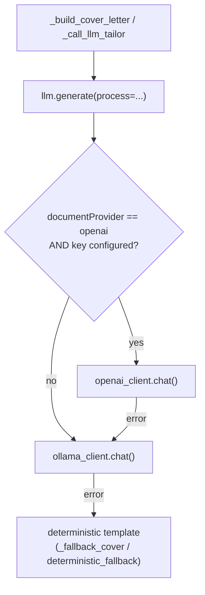

# Document generation provider toggle (Ollama vs OpenAI)

## Current state

Every LLM call in `cv/` goes through one function, `chat()` in [cv/services/shared/cv_shared/ollama_client.py](cv/services/shared/cv_shared/ollama_client.py), from five call sites. Only two matter here: `_build_cover_letter` ([cv/services/shared/cv_shared/documents.py](cv/services/shared/cv_shared/documents.py) line 96) and `_call_ollama_tailor` ([cv/services/shared/cv_shared/resume/tailor.py](cv/services/shared/cv_shared/resume/tailor.py) line 434). Both already wrap the call in `try/except` with a deterministic non-LLM fallback, so the safety net exists.

Settings are one Mongo doc (`cv_settings`, `_id: "app"`) normalized in [cv/services/shared/cv_shared/settings.py](cv/services/shared/cv_shared/settings.py), exposed by `GET`/`PATCH /settings` in [cv/services/api/main.py](cv/services/api/main.py) lines 395-407, and rendered as instant-save coss `Switch` rows in [cv/services/web/app/settings/page.js](cv/services/web/app/settings/page.js).

## Dispatch flow



## Backend

**New `cv/services/shared/cv_shared/openai_client.py`** — mirrors `ollama_client.py` and the secrets pattern in [cv/services/shared/cv_shared/github/client.py](cv/services/shared/cv_shared/github/client.py) lines 19-39. Stdlib `urllib` only, no new dependency:

- `openai_api_key()` reads `secrets/openai-api-key` (override `OPENAI_API_KEY_FILE`), falling back to the `OPENAI_API_KEY` env var
- `key_configured() -> bool`
- `openai_model()` from `OPENAI_MODEL`, default `gpt-4o-mini`
- `chat(prompt, system=None, temperature=0.2, response_format=None)` POSTs to `https://api.openai.com/v1/chat/completions`, returns `choices[0].message.content`

One shape difference to handle: `TAILOR_JSON_SCHEMA` (tailor.py line 41) is a bare Ollama-style schema. Wrap it as `{"type": "json_schema", "json_schema": {"name": "tailor", "schema": <dict>}}`. The Ollama-only `think` flag is simply ignored on this path.

**New `cv/services/shared/cv_shared/llm.py`** — thin dispatcher so call sites stay clean:

```python
DOCUMENT_PROVIDER_PROCESSES = ("coverLetter", "resumeTailor")

def generate(prompt, *, system=None, temperature=0.2, process=None,
             response_format=None) -> LlmResult:  # .text, .provider
```

If `process` is a document process, the setting is `openai`, and a key is configured, try OpenAI; on any exception log a warning and fall through to `ollama_client.chat(...)` with the original `think_process=process`. Otherwise go straight to Ollama.

**`settings.py`** — new slice alongside the existing six:

```python
DOCUMENT_PROVIDERS = ("ollama", "openai")
DEFAULT_DOCUMENT_PROVIDER = {"provider": "ollama"}
```

Add `_normalize_document_provider`, wire it into `default_app_settings()`, the `get_app_settings()` self-heal comparison and `$set`, the `patch_app_settings()` merge and return dict, and add a reader `get_document_provider(settings=None)`.

**`api/main.py`** — add `documentProvider: Optional[dict[str, Any]] = None` to `SettingsPatchBody` (line 60). Both settings endpoints inject two derived, never-persisted fields so the UI can show status without ever seeing the key:

```python
"documentProvider": {**doc["documentProvider"],
                     "openaiConfigured": key_configured(),
                     "openaiModel": openai_model()}
```

**Call sites** — `documents.py` line 96 and `tailor.py` line 434 switch to `llm.generate(...)`. Rename `_call_ollama_tailor` to `_call_llm_tailor` and thread `result.provider` into `TailorPayload` so the generated tailor report records which provider produced the bullets. Existing `except` branches and `verify_tailor_payload` grounding checks are untouched.

## Web UI

In [cv/services/web/app/settings/page.js](cv/services/web/app/settings/page.js), add a `documentProvider` state slice (load, `syncFromResponse`, defaults) and a `setDocumentProvider(provider)` handler copied from `setResumeEngine` (line 337) — optimistic update, `setSavingKey`, `apiPatch("/settings", { documentProvider: { provider } })`, revert on error.

New "Document generation" section rendered above "Ollama thinking", following the existing `Card` → `CardPanel` → `Switch` idiom:

- Switch label "Use OpenAI for cover letter and resume", `checked={documentProvider.provider === "openai"}`
- `disabled={!!savingKey || !documentProvider.openaiConfigured}`
- Description names the active model and, when no key is present, says to add one at `secrets/openai-api-key` — the same "here's where the file goes" approach used for the GitHub PAT at `app/repositories/page.js` line 362
- Note that failures fall back to Ollama, and that the Ollama thinking toggles below only apply on that fallback

Also extend the intro paragraph at line 370.

## Config and docs

- [cv/.env.example](cv/.env.example): replace the dead `CLOUD_LLM_ENABLED=false` (line 24, declared but never read) with `OPENAI_MODEL=gpt-4o-mini` plus a comment pointing at `secrets/openai-api-key`
- [cv/docker-compose.yml](cv/docker-compose.yml): add `OPENAI_MODEL` and `OPENAI_API_KEY` passthrough to the `api` and `worker` services; `./secrets` is already mounted into both
- `cv/secrets/README.md`: document the `openai-api-key` file. `.gitignore` already covers `secrets/*`
- `cv/docs/COLLECTIONS.md`: add `documentProvider` to the settings doc shape (and fix the stale field list at line 105 while there)
- `cv/docs/ARCHITECTURE.md`: note the provider seam

## Verification

1. `docker compose up -d --build api worker web`
2. `curl localhost:8000/settings` shows `documentProvider: {provider: "ollama", openaiConfigured: false, openaiModel: "gpt-4o-mini"}` and the switch renders disabled
3. Write a key to `cv/secrets/openai-api-key`, restart `api`, confirm the switch enables and flips
4. Generate a package on a job with the toggle on; confirm the tailor report records `provider: "openai"`
5. Set a deliberately bad key and regenerate — expect a warning in `docker compose logs api` and a valid package produced via Ollama