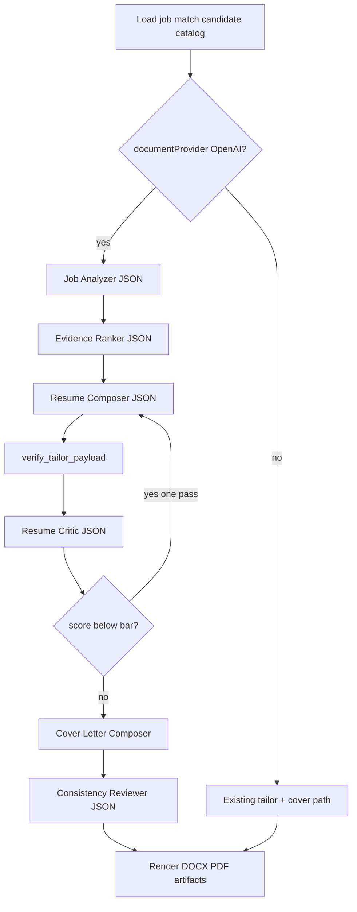

# Multi-stage OpenAI document generation

## Context

Document generation is in **dtp-yui** ([`cv/services/shared/cv_shared/documents.py`](cv/services/shared/cv_shared/documents.py)), not dtp-os. OpenAI is the Settings toggle `documentProvider.provider === "openai"` ([`llm.py`](cv/services/shared/cv_shared/llm.py) — only `coverLetter` + `resumeTailor` today).

Current path when generating: load match → **one-shot** `tailor_resume` → render → **one-shot** cover letter. Grounding is strong (`sourceId` + `verify_tailor_payload`) but quality is single-prompt. Analyze stays separate (Ollama + deterministic score).

**Hard constraints to keep:** verified catalog IDs only; never invent metrics/employers/tech; deterministic fallbacks; agent-compatible filenames (`resume.pdf`, `cover-letter.pdf`).

## Approach

When OpenAI is on, replace the two single-shot calls with a staged orchestrator. When Ollama is on, keep the current two-call path (prompt text can share the same system/prompt modules for consistency, but no multi-call critic loop on Ollama to control latency).



## New module layout

Under `cv/services/shared/cv_shared/package/`:

| Module | Role |
|--------|------|
| [`pipeline.py`](cv/services/shared/cv_shared/package/pipeline.py) | Orchestrates stages; called from `generate_application_package` |
| [`job_analyzer.py`](cv/services/shared/cv_shared/package/job_analyzer.py) | Stage 1: JD → structured analysis |
| [`evidence_ranker.py`](cv/services/shared/cv_shared/package/evidence_ranker.py) | Stage 2–3: score catalog + skills + projects |
| [`prompts.py`](cv/services/shared/cv_shared/package/prompts.py) | Elite system prompts (resume/cover/critic/consistency) |
| [`cover_letter.py`](cv/services/shared/cv_shared/package/cover_letter.py) | Cover letter composer + fallback (move from `documents.py`) |
| [`consistency.py`](cv/services/shared/cv_shared/package/consistency.py) | Cross-check resume vs letter vs evidence |
| [`reports.py`](cv/services/shared/cv_shared/package/reports.py) | Keyword coverage, fit score, talking points, strategy markdown |

Resume select+rewrite stays in [`resume/tailor.py`](cv/services/shared/cv_shared/resume/tailor.py) but accepts pre-ranked context and the upgraded system prompt.

## Stage contracts (JSON, verified)

### 1. Job Analyzer (`process=jobAnalyzer`)

Input: job title/company/location/URL, JD (truncate ~6k), existing match extract (requirements, roleFamily, score, strong matches, gaps).

Output (Pydantic):
- `primaryResponsibilities`, `requiredQualifications`, `preferredQualifications`
- `atsKeywords[]`, `culturalSignals[]`, `seniorityExpectations`
- `interviewDeciders[]` (3–5)
- per-requirement `{ text, class: critical|important|helpful|unnecessary }`
- `positioning` (e.g. Platform Engineer) — **headline only**; employment titles unchanged
- `candidateGaps[]` (honest)

On failure: build minimal analysis from existing `cv_jobMatches` + empty keyword list.

### 2. Evidence Ranker (`process=evidenceRanker`)

Input: analyzer output + full achievement catalog slim + approved skills + projects + match strong-match evidence IDs.

Output:
- per achievement: `{ sourceId, score 0–100, reasons[] }`
- ranked `skillIds`, `projectIds`
- `recommendedBulletCap` respect for pages
- `highlightSourceIds` (4–6 top work bullets for Selected Highlights)

Deterministic fallback: sort by existing match skill hits + recency + `PROJECT_PRIORITY` (today’s fallback logic).

### 3. Resume Composer (`process=resumeTailor`)

Upgrade [`RESUME_TAILOR_SYSTEM`](cv/services/shared/cv_shared/resume/tailor.py) to the elite ATS prompt **shortened** for tool use, keeping hard rules:
- Every rewrite needs catalog `sourceId`
- No invented metrics/tech/employers/dates
- Action → technology → impact where source supports
- Vary verbs; keywords only if truthful

User prompt gets analyzer JSON + top-N ranked achievements (not entire unsorted dump) + full catalog IDs still listed so model cannot invent IDs.

Extend `TailorPayload` / schema:
- `highlights: [{ sourceId, text }]` max 6, same rewrite safety as bullets
- `skillsGrouped: { category: [skillIds] }` optional — if missing, group by skill.category at render time from `selectedSkillIds`

Still run `verify_tailor_payload` (expand for highlights).

### 4. Resume Critic (`process=resumeCritic`)

Input: renderer-facing plain-text preview of tailored content + analyzer + selected evidence.

Output scores 1–10 (ATS, relevance, credibility, clarity, seniority, evidence, scanability, truthfulness) + `mustFix[]` + `optionalImprove[]`.

If mean score &lt; 7 **or** any mustFix: one revision call to Resume Composer with critic feedback (hard cap: **1** revision). Re-verify. Never loop forever.

### 5. Cover Letter Composer (`process=coverLetter`)

Replace thin [`COVER_SYSTEM`](cv/services/shared/cv_shared/documents.py) with the elite cover-letter system (300–450 words, 3–5 paragraphs, no “I am writing to express…”, no generic company flattery).

**Shared context required** (not independent evidence dump):
- job analyzer output
- final verified `TailorPayload` (selected bullets/rewrites, summary, targetRole)
- only evidence/claims that map to selected sourceIds + match
- candidate profile (name, email, location, positioning)
- company about only from job fields / description — no invented company knowledge

### 6. Consistency Reviewer (`process=consistencyReview`)

Input: resume plain text, cover letter, analyzer, selected achievement source statements.

Output:
- flags: title/date mismatches, unsupported claims, resume↔cover wording clones, invented tech
- `coverEdits` optional revised letter if flags are fixable without new facts
- final `safeCoverLetter` text

Apply coverEdits only when all claims pass a simple phrase-grounding check against selected sources (reject rewrite if it introduces employer names outside the allow-list, same idea as `_rewrite_is_safe`).

## Package artifacts (new + existing)

Keep existing render + files. Add under the package folder and previews:

| File | Content |
|------|---------|
| `job-analysis.json` | Stage 1 output |
| `evidence-ranking.json` | Stage 2 scores + used sourceIds |
| `ats-keywords.md` | Keyword coverage vs resume+cover |
| `fit-assessment.md` | Score, strengths, material gaps |
| `interview-talking-points.md` | From critic/strategy stage |
| `tailoring-strategy.md` | Why this positioning/bullets |
| `application-report.json` | Structured record of stages, scores, providers |

Upgrade [`application-answers.md`](cv/services/shared/cv_shared/documents.py) to pull from fit assessment / talking points when available (not only template).

**Filenames:** keep `resume.pdf` / `cover-letter.docx` (agent + UI downloads). Put export-friendly names only as labels in `downloads[]` if useful — do not rename on-disk paths.

## LLM routing / settings

In [`llm.py`](cv/services/shared/cv_shared/llm.py), extend `DOCUMENT_PROVIDER_PROCESSES` with:

`jobAnalyzer`, `evidenceRanker`, `resumeCritic`, `consistencyReview`

(resumeTailor + coverLetter already routed.)

In [`settings.py`](cv/services/shared/cv_shared/settings.py) / Ollama think allowlist, register the new process keys (think only applies if Ollama fallback hits them).

[`openai_usage`](cv/services/shared/cv_shared/openai_usage.py) + web usage chart already use `byProcess` — new keys appear automatically.

## Wire into package generation

Refactor [`generate_application_package`](cv/services/shared/cv_shared/documents.py):

```python
if get_document_provider() == "openai" and openai key:
    ctx = run_openai_package_pipeline(...)  # stages above
    payload = ctx.payload
    cover = ctx.cover_letter
    write stage reports...
else:
    payload = tailor_resume(...)  # existing
    cover = build_cover_letter(...)  # existing path, improved prompts optional
```

Then existing `_render_resume_artifacts` + DOCX/PDF for cover + Mongo package doc.

Expand package Mongo fields: `pipeline: "openai-multistage" | "simple"`, stage providers, fit score, critic scores.

## Render support for highlights + grouped skills

- [`render_docx.py`](cv/services/shared/cv_shared/resume/render_docx.py), [`render_rendercv.py`](cv/services/shared/cv_shared/resume/render_rendercv.py), [`legacy.py`](cv/services/shared/cv_shared/resume/legacy.py): after summary, if `payload.highlights`, emit **Selected Highlights** (or **Highlights**); skills section prefer category groups ordered by analyzer/role priority.
- Default section order: `summary`, `highlights`, `skills`, `experience`, `projects`, `education`.

## UI / copy (small)

- Job detail generate steps ([`jobs/[jobId]/page.js`](cv/services/web/app/jobs/[jobId]/page.js)): replace hardcoded “Ollama” with provider-neutral steps (Analyzing role…, Ranking evidence…, Composing resume…, Writing cover letter…, Reviewing consistency…). Steps stay cosmetic unless you later stream progress.
- [`DocumentPackagePanel.js`](cv/services/web/app/components/DocumentPackagePanel.js): surface new previews (fit, keywords, talking points); fix “Ollama tailor” label to use `selection-report.provider` / `pipeline`.
- Settings label can stay “Use OpenAI for cover letter and resume” or become “Use OpenAI multi-stage package generation”.

No dtp-os changes.

## Docs

Update [`cv/docs/RESUME_PIPELINE.md`](cv/docs/RESUME_PIPELINE.md) and a short subsection in [`cv/docs/ARCHITECTURE.md`](cv/docs/ARCHITECTURE.md): multi-stage only when OpenAI on; grounding contract unchanged.

## Failure / cost policy

- Stage failure → degrade gracefully (skip critic / use match-only analyzer / deterministic rank / template cover).
- Max OpenAI calls per package: ≈5–6 (analyzer, ranker, tailor, critic, optional 1 revise, cover, consistency). Prefer slightly larger models already chosen in Settings; temperature low (0.1–0.3).
- Record usage per process.

## Out of scope

- Replacing Mongo career bank with a single “master resume” upload file
- Changing analyze/inbox pipelines to always use OpenAI
- Agent ATS upload path changes
- Real-time SSE stage streaming (cosmetic steps only for now)
