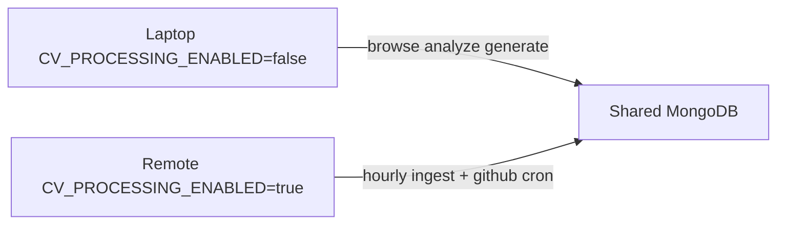

# Host processing role (`CV_PROCESSING_ENABLED`)

## Problem

Laptop (debug) and remote (real processing) share one MongoDB. Both run the Compose **worker**, which:

- Starts ingest on boot (`INGEST_ON_START`, default true)
- Cron ingest every hour (`:00`)
- Cron GitHub scan (`:30`)

Both hosts race on the same `cv_systemRuns` lock / Gmail markers / source polls.

## Recommendation

Use one clear ENV (not a vague `process=false`):

```bash
# Laptop (.env)
CV_PROCESSING_ENABLED=false

# Remote (.env)
CV_PROCESSING_ENABLED=true   # or omit — default true
```

**Meaning:** this host may run *automatic* background processing.  
**Out of scope for the flag:** one-off user actions you named — `POST /jobs/{id}/analyze`, generate docs, and similar interactive API calls stay available on the laptop.

Ops shortcut that already works today: on the laptop run `docker compose up -d api web` and **omit `worker`**. The ENV makes the intent explicit if the worker container is still started by habit.



## Behavior when `CV_PROCESSING_ENABLED=false`

### Worker — [`cv/services/worker/main.py`](cv/services/worker/main.py)

- Log: `Background processing disabled (CV_PROCESSING_ENABLED=false); idling`
- Skip scheduling ingest/github cron
- Skip `INGEST_ON_START` / `GITHUB_SCAN_ON_START`
- Keep process alive (Compose `restart`) so the service can stay defined
- `AUTO_SEED` can still run once (idempotent, low risk); leave it on unless you prefer seeding only on remote

### API — do **not** blanket-block interactive work

Leave enabled:

- Job analyze / re-analyze
- Generate documents
- Settings, Sources edits, application status, CRUD

Leave enabled as intentional one-offs (you may still hit a remote lock if an ingest is mid-flight — existing 409/single-flight):

- `POST /ingest/run` (Inbox Run ingest)
- Source Poll / Poll all
- Analyze queue enqueue + manual drain kick

No change required for those paths unless you later want a stricter “read-mostly laptop” mode.

### UI (small)

- Settings or Inbox footer note when processing is disabled: “Background processing is off on this host — hourly ingest runs on the processor.”
- Expose via `GET /settings` or a tiny `GET /health` / `GET /runtime` field `processingEnabled` so the web container doesn’t need the ENV baked in at build time (read from API).

## Implementation steps

1. Add helper in shared code, e.g. [`cv/services/shared/cv_shared/runtime.py`](cv/services/shared/cv_shared/runtime.py):

```python
def processing_enabled() -> bool:
    return os.environ.get("CV_PROCESSING_ENABLED", "true").lower() in ("1", "true", "yes")
```

2. Gate worker `main()` scheduler + on-start jobs with that helper.
3. Pass `CV_PROCESSING_ENABLED` through [`docker-compose.yml`](cv/docker-compose.yml) `worker` (and `api` if exposing status).
4. Document in [`.env.example`](cv/.env.example) + short note in README / GMAIL_SETUP: laptop = `false`, remote = `true`; prefer not running worker on laptop.
5. Optional: `GET /runtime` → `{ processingEnabled }` + muted banner on Inbox when false.

## What not to do

- Don’t invent separate Mongo DBs for this — you already want shared data.
- Don’t disable analyze/generate on the laptop.
- Don’t rely only on `INGEST_ON_START=false` — hourly cron would still collide.
