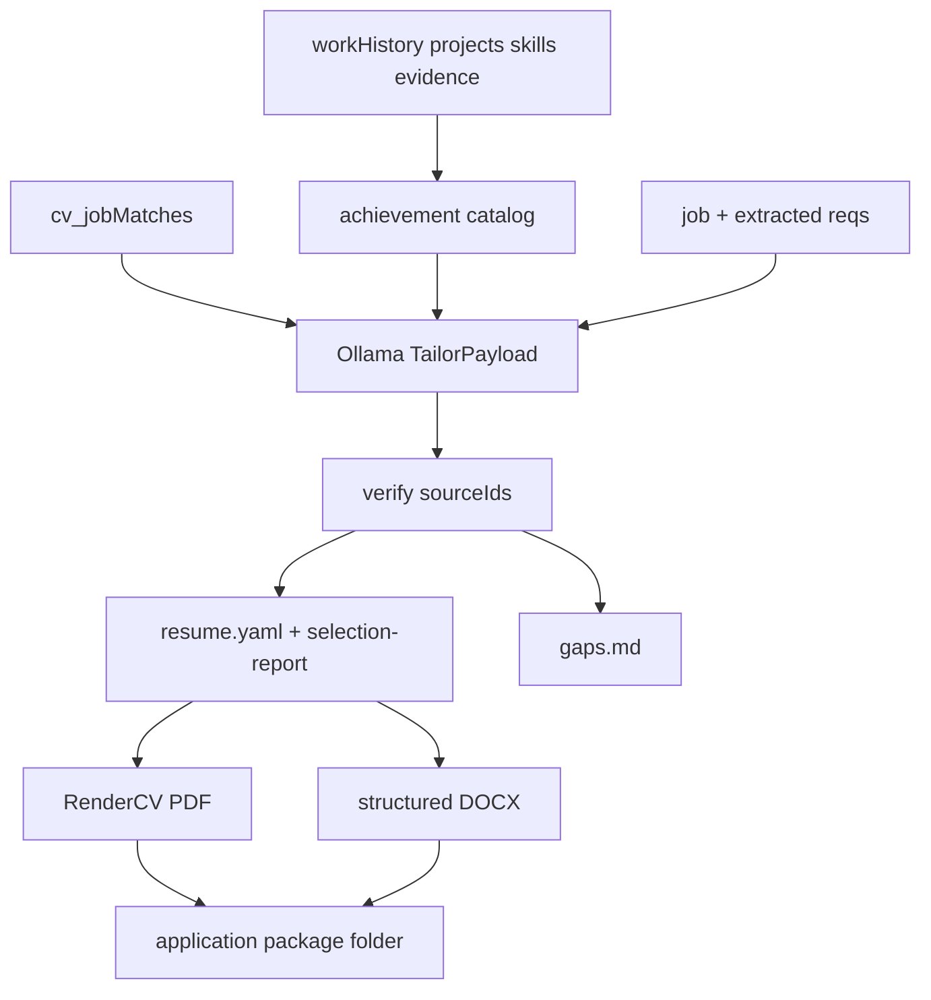

# Resume optimization pipeline

## Problem

[`documents.py`](cv/services/shared/cv_shared/documents.py) builds resumes as plain string lines → ReportLab/DOCX. Selection is coarse role-family reordering; only the cover letter uses Ollama. Layout is weak and there is no intermediate structured resume object.

## Locked decisions

- **Career truth:** existing Mongo `cv_workHistory` / `cv_projects` / `cv_skills` / `cv_evidence` (no new `cv_achievements` collection)
- **Achievement IDs:** derived at generate time — `work:{workHistoryId}:b{i}`, `project:{projectId}:b{i}`
- **Tailor:** Ollama select + rewrite; every rewrite must cite `sourceId`; app verifies against approved catalog
- **Schema:** Pydantic `TailorPayload` (not Zod/Node)
- **PDF renderer:** RenderCV YAML → PDF; install `rendercv` in API (+ worker if shared) Docker images
- **DOCX:** rebuilt from the same validated payload via `python-docx` (not PDF→Word)
- **Rollback:** `cv_settings.resume.renderEngine`: `"rendercv"` | `"legacy"` (default `"legacy"` until flip)
- **Out of scope this round:** Playwright/React themes, Reactive Resume editor, new achievement seed migration, DOCX via third-party builders

## Architecture



## Implementation

### 1. Package layout

New package under shared lib:

- [`cv/services/shared/cv_shared/resume/achievements.py`](cv/services/shared/cv_shared/resume/achievements.py) — `build_achievement_catalog()` from approved work bullets + project `resumeBullets`, attaching `skillIds`, employer, dates, parent ids
- [`cv/services/shared/cv_shared/resume/tailor.py`](cv/services/shared/cv_shared/resume/tailor.py) — `RESUME_TAILOR_SYSTEM`, `tailor_resume(...)`, Pydantic models, verify + deterministic fallback (match-driven selection using original statements)
- [`cv/services/shared/cv_shared/resume/render_rendercv.py`](cv/services/shared/cv_shared/resume/render_rendercv.py) — map payload + candidate → RenderCV YAML, invoke CLI/API, write PDF
- [`cv/services/shared/cv_shared/resume/render_docx.py`](cv/services/shared/cv_shared/resume/render_docx.py) — sectioned DOCX from payload
- [`cv/services/shared/cv_shared/resume/legacy.py`](cv/services/shared/cv_shared/resume/legacy.py) — move current `_build_resume_lines` / ReportLab path here for `renderEngine=legacy`

### 2. Tailor contract

```json
{
  "targetRole": "...",
  "summary": "...",
  "selectedAchievementIds": ["work:work_c1_associate:b0"],
  "rewrittenAchievements": [{"sourceId": "work:work_c1_associate:b0", "text": "..."}],
  "selectedSkillIds": ["skill_python"],
  "selectedProjectIds": ["project_sway_sls"],
  "omittedRequirements": ["..."],
  "sectionOrder": ["summary", "skills", "experience", "projects", "education"]
}
```

Verify after LLM:

1. Drop unknown / non-approved `sourceId`s
2. Missing rewrite → use catalog `statement`
3. Lightweight token check: rewritten text may not introduce employer names absent from source; on fail, revert to original statement
4. Enforce page budget caps (e.g. ≤2 pages → ~8–12 bullets total)
5. Always emit `selection-report.json` with chosen ids, omitted reqs, and whether LLM or fallback ran

Extend [`ollama_client.chat`](cv/services/shared/cv_shared/ollama_client.py) with optional `format` (JSON schema) for structured output; keep `extract_json` fallback. Add `resumeTailor` to `OLLAMA_THINK_PROCESSES` in [`settings.py`](cv/services/shared/cv_shared/settings.py).

### 3. RenderCV integration

- Add `rendercv` to [`cv/services/api/requirements.txt`](cv/services/api/requirements.txt) (and worker if it imports documents)
- One pinned theme (`classic` / technical-clean equivalent)
- Map: candidate contact + education + tailored summary/skills + experience groups (by work role) + independent projects section
- On RenderCV failure → log + fall back to legacy PDF so generate never hard-fails

### 4. Wire generate package

Refactor [`generate_application_package`](cv/services/shared/cv_shared/documents.py):

```text
catalog → tailor → verify → write resume.yaml + selection-report.json + gaps.md
→ render PDF/DOCX by settings.resume.renderEngine
→ existing cover letter + match artifacts unchanged
```

Package folder gains:

- `resume.yaml`, `selection-report.json`, `gaps.md`
- existing `resume.pdf` / `resume.docx` paths preserved

Persist on package/document meta: `tailorPayload` summary, `renderer`, `templateId`.

### 5. Settings + UI

- Settings defaults: `resume: { renderEngine: "legacy" }` then flip to `"rendercv"` after validation
- Settings UI: render engine select + `resumeTailor` think toggle (mirror other Ollama process toggles in [`settings/page.js`](cv/services/web/app/settings/page.js))
- [`DocumentPackagePanel.js`](cv/services/web/app/components/DocumentPackagePanel.js): show short selection summary (bullet count, omitted requirements) + download report/yaml when present

### 6. Docs

- Update [`cv/docs/ARCHITECTURE.md`](cv/docs/ARCHITECTURE.md) evidence section with tailor verify step
- Add Stage note in [`cv/docs/ROADMAP.md`](cv/docs/ROADMAP.md) (Resume tailor + RenderCV, adjacent to Stage 4/5)
- Add [`cv/docs/RESUME_PIPELINE.md`](cv/docs/RESUME_PIPELINE.md) — ID format, verify rules, how to switch renderer

## Ship order

1. Catalog + TailorPayload + verify + `selection-report.json` beside **legacy** PDF
2. RenderCV path behind `renderEngine` flag
3. UI/settings/docs; flip default to `rendercv` once smoke-tested on a systems vs product job

## Success criteria

- Systems vs product jobs select different `sourceId`s and summaries
- Zero resume bullets without resolvable approved `sourceId`
- Generate still succeeds if Ollama or RenderCV fails (fallback)
- `selection-report.json` explains emphasis and JD gaps
