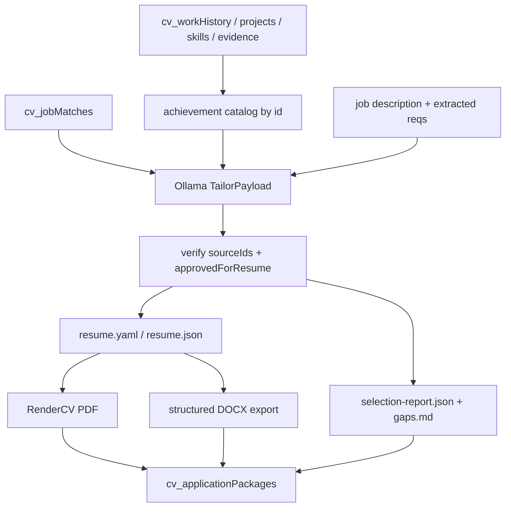

# Resume optimization pipeline (content ≠ design)

## Why this exists

Today [`documents.py`](cv/services/shared/cv_shared/documents.py) builds a **deterministic plain-text resume** (role-family bullet reorder → `python-docx` + ReportLab). Only the cover letter uses Ollama. Layout quality is weak; bullet selection is coarse; there is no rewrite step and no intermediate structured resume object.

The right split:

```text
Mongo career evidence (truth)
        ↓
Job match (already exists)
        ↓
Ollama: select + rewrite (sourceId only)
        ↓
Validated TailorPayload (Pydantic)
        ↓
Deterministic renderer (RenderCV → PDF; same object → DOCX)
        ↓
generated-applications/{company}-{role}/
```

**Rule:** the model must never invent an achievement without a `sourceId`. Schema-constrained JSON is not enough — the app must verify every claim against approved career evidence.

## What we already have (reuse, don’t rebuild)

| Asset | Location | Role in this plan |
|---|---|---|
| Skills / work / projects / evidence | `cv/seed/*.json` → Mongo `cv_*` | Master career DB |
| `approvedForResume` | skills, evidence, GitHub ladder | Factual gate |
| Role family + match score | [`matching.py`](cv/services/shared/cv_shared/matching.py) | Tailor input |
| Package folder + APIs | `POST /jobs/{id}/generate`, `DocumentPackagePanel` | Delivery surface |
| Ollama + `thinkByProcess` | [`ollama_client.py`](cv/services/shared/cv_shared/ollama_client.py), settings | Add `resumeTailor` |
| Cover letter LLM | `COVER_SYSTEM` in documents | Keep; same grounding rules |

Stack stays **Python FastAPI + Mongo + Ollama** (not a greenfield Node/Zod CLI). Use **Pydantic** where the external writeup said Zod.

## Target architecture



### Open-source borrow list (inspect, don’t fork)

| Project | Borrow for | Skip for now |
|---|---|---|
| [RenderCV](https://github.com/rendercv/rendercv) | Typographic PDF, YAML-as-code, pagination | Full academic theme set |
| [JSON Resume](https://jsonresume.org/) | Optional interchange schema | Theme CLI as primary renderer |
| [Reactive Resume](https://github.com/amruthpillai/reactive-resume) | Template / section-order ideas | Full Canva-like editor |
| [OpenResume](https://github.com/xitanggg/open-resume) | ATS layout decisions | Browser PDF as primary |
| [Resume Matcher](https://github.com/srbhr/Resume-Matcher) | Keyword / gap framing | Replacing our matcher |
| [resume-as-code](https://github.com/silverbeer/resume-as-code) | Prompt rules for selection integrity | Claude-specific runtime |

**MVP renderer recommendation: RenderCV.** Fastest path to polished PDFs without building print CSS. Later swap to React + Playwright when visual variety matters.

---

## Phase 0 — Achievement catalog (content model)

Promote flat bullets into addressable units so Ollama selects IDs instead of free-composing careers.

### Option A (preferred, minimal schema churn)

Derive achievements at generate-time from existing docs:

```text
work:{workHistoryId}:b{index}     ← workHistory.bullets[i]
project:{projectId}:b{index}      ← projects.resumeBullets[i]
evidence:{evidenceId}             ← approved claims (optional bullet source)
```

Enrich with metadata from parent docs (`skillIds`, company, dates, `approvedForResume`).

### Option B (richer, later seed migration)

Add explicit `achievements[]` on work/project docs (or `cv_achievements` collection):

```yaml
id: work_c1_associate:b0
employer: Capital One
role: Associate Software Engineer
statement: Built infrastructure for a Salesforce-to-S3 backup...
skillIds: [skill_apache_spark, skill_aws_s3, ...]
categories: [cloud, data, infrastructure]
evidenceIds: [evidence_c1_salesforce_s3]
allowedRewrites: [shorten, emphasizeRelevantSkills, actionResult]
approvedForResume: true
```

**Ship Option A in MVP**; migrate to Option B if rewrite quality needs stronger per-bullet metadata.

New module: [`cv_shared/resume/achievements.py`](cv/services/shared/cv_shared/resume/achievements.py) — `build_achievement_catalog(candidate_id) -> list[Achievement]`.

---

## Phase 1 — Tailor step (Ollama select + rewrite)

New module: [`cv_shared/resume/tailor.py`](cv/services/shared/cv_shared/resume/tailor.py)

### Input

- Job title, company, description (or match `extractedRequirements`)
- `roleFamily`, strong matches, meaningful gaps
- Achievement catalog (id + statement + skills + employer) — **approved only**
- Positioning summary for role family
- Page budget (`pages: 1 | 2`), optional template key

### Output schema (`TailorPayload` — Pydantic)

```json
{
  "targetRole": "Principal Software Engineer",
  "summary": "...",
  "selectedAchievementIds": ["work_c1_associate:b0", "..."],
  "rewrittenAchievements": [
    { "sourceId": "work_c1_associate:b0", "text": "Led..." }
  ],
  "selectedSkillIds": ["skill_aws_s3", "skill_python"],
  "selectedProjectIds": ["project_sway_sls"],
  "omittedRequirements": ["Direct CUDA kernel development"],
  "sectionOrder": ["summary", "skills", "experience", "projects", "education"]
}
```

### Hard validation (after LLM)

1. Every `sourceId` exists in catalog and `approvedForResume`
2. Rewrite text is non-empty and does not introduce employer/tool tokens absent from source + linked skills (lightweight allowlist check; fail closed → fall back to original statement)
3. Drop unknown IDs; never invent replacements
4. Cap bullets per role / total length for page budget
5. Persist raw + validated payload for audit

### Ollama

- Extend [`ollama_client.py`](cv/services/shared/cv_shared/ollama_client.py) to prefer **schema-constrained structured outputs** when the installed Ollama version supports `format`/JSON schema; keep `extract_json` fallback
- Server-side prompt constant `RESUME_TAILOR_SYSTEM` (same pattern as `COVER_SYSTEM`)
- Settings: `cv_settings.ollama.thinkByProcess.resumeTailor`
- Temperature low (≈0.2); on failure → deterministic selection from match evidence (today’s behavior) so generate never hard-fails

---

## Phase 2 — Render (design layer)

New module: [`cv_shared/resume/render.py`](cv/services/shared/cv_shared/resume/render.py)

### MVP: RenderCV

```text
TailorPayload + candidate profile
  → rendercv_data.yaml
  → rendercv render → resume.pdf
```

- Docker: add RenderCV to API image (or slim sidecar) — pin version
- One theme to start (`classic` / technical-clean); map role family → theme variant later
- Keep generating **DOCX from the same structured object** (improved `python-docx` section builder — not PDF→Word conversion)
- Do **not** put LLM near CSS

### Package outputs (extend existing folder)

```text
generated-applications/{company}-{role}/
├── resume.pdf                 # RenderCV
├── resume.docx                # same content model
├── resume.yaml                # RenderCV source (or resume.json)
├── selection-report.json      # ids chosen, rewrites, omitted reqs
├── gaps.md                    # human-readable from match gaps + omitted
├── cover-letter.md / .docx    # existing
├── match-analysis.json        # existing
└── ...
```

### V2 (after tailor is reliable)

- Custom HTML templates (Jinja2 or React in web) + Playwright PDF for full design control
- Themes: `technical-clean`, `modern-compact`, `principal-dense`
- Print CSS: `break-inside: avoid`, Letter/A4, 1–2 page density knobs
- Optional: Reactive Resume only if you want a manual visual editor over the generated payload

---

## Phase 3 — Wire into generate + UI

### Backend

- Refactor [`generate_application_package`](cv/services/shared/cv_shared/documents.py):  
  `catalog → tailor → verify → render` instead of `_build_resume_lines`
- Keep cover letter path; optionally pass `selection-report` into cover context for consistency
- Store on `cv_documents` / package meta: `tailorPayload`, `renderer: "rendercv"|"legacy"`, `templateId`
- Feature flag in settings: `resume.renderEngine: rendercv | legacy` for rollback

### Frontend (light)

- [`DocumentPackagePanel.js`](cv/services/web/app/components/DocumentPackagePanel.js): show selection report summary (selected bullets, omitted requirements), download `resume.yaml` / report
- Job generate button unchanged; optional “pages / template” controls later on job page
- Settings: toggle `resumeTailor` think + render engine

### Docs

- Update [`ARCHITECTURE.md`](cv/docs/ARCHITECTURE.md) evidence-grounding section with tailor verify step
- Add roadmap stage note (suggest **Stage 4.5 / Stage 5 adjacent**: “Resume tailor + RenderCV”) in [`ROADMAP.md`](cv/docs/ROADMAP.md)
- Short `cv/docs/RESUME_PIPELINE.md` — catalog IDs, verify rules, how to add a theme

---

## Suggested MVP scope (one focused PR series)

1. **PR1 — Catalog + TailorPayload + verify** (no renderer change; write `selection-report.json` beside legacy PDF)
2. **PR2 — RenderCV PDF path** behind `renderEngine` flag; legacy remains default until validated
3. **PR3 — Flip default**, richer DOCX from payload, UI report panel, docs/roadmap

Out of scope for MVP:

- Forking Reactive Resume / OpenResume
- DOCX via No Strings Resume
- Autonomous apply / ATS form fill (Stage 6)
- Model inventing new employers or metrics
- Multi-candidate resumes

---

## Design constraints (dtp-yui)

- Prompts stay server-side Python constants
- Mongo/API fields camelCase (`sourceId`, `selectedAchievementIds`, `allowedRewrites`, `renderEngine`)
- No secrets in generated package artifacts
- Human review before apply unchanged
- Web UI stays JS + coss; no need for Zod/TS in the tailor path

## Success criteria

- Generate for a systems vs product job yields **different** selected `sourceId`s and summaries
- Zero resume bullets without a resolvable approved `sourceId`
- PDF is typographically competitive with a hand-tuned one-pager (RenderCV)
- Fallback path still produces a package if Ollama/RenderCV fails
- `selection-report.json` explains what was emphasized and what JD gaps remain

## Effort sketch

| Slice | Rough size |
|---|---|
| Achievement catalog + Pydantic + verify | ~0.5–1 PR |
| Ollama tailor + settings | ~0.5 PR |
| RenderCV Docker + map + flag | ~1 PR |
| UI report + docs + default flip | ~0.5 PR |

Total: **~2–3 focused PRs** to MVP; Playwright themes as a later stage once selection quality is trusted.
