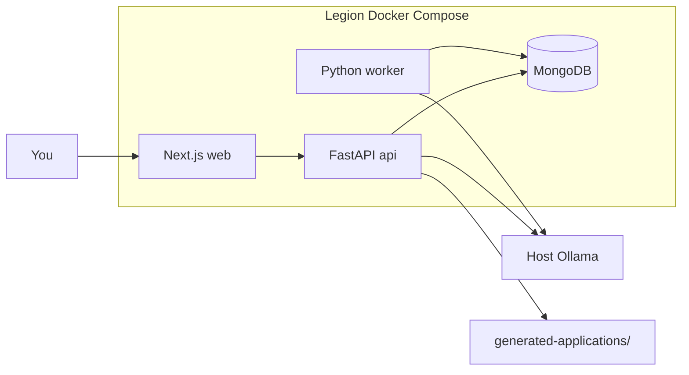

# dtp-yui `cv` — Stage 1 + Future Roadmap

## Context

[dtp-yui](file:///Users/argo/Code/dtp/dtp-yui) is a local-agent toolkit (`travel/` = Node CLI). `cv` will live at **`dtp-yui/cv/`** but use the **revised stack** (not the travel pattern): Next.js + FastAPI + MongoDB + Python worker, Docker Compose on the Legion, Ollama on the host.

Seed content comes from:
- [TEMPLATE-SKILLS.md](file:///Users/argo/Code/atos/osco-dot-blog-v2/public/cv/TEMPLATE-SKILLS.md)
- [TEMPLATE-PROJECTS.md](file:///Users/argo/Code/atos/osco-dot-blog-v2/public/cv/TEMPLATE-PROJECTS.md)

Layout inspiration: [dtp-videodl](file:///Users/argo/Code/dtp/dtp-videodl) (`api/` + `ui/` + compose), adapted to the multi-service layout you specified.

## Architecture (Stage 1)



**Bindings:** `127.0.0.1:3000` (web), `127.0.0.1:8000` (api). Access remotely via WireGuard + SSH port forward — no public inbound.

**Ollama:** host service; worker/api use `host.docker.internal:11434` (`extra_hosts: host-gateway` on Linux).

## Repo layout

```text
dtp-yui/cv/
├── README.md
├── docker-compose.yml
├── .env.example
├── .gitignore                 # secrets/, .env, generated-applications/, repository-cache/
├── docs/
│   ├── ARCHITECTURE.md
│   ├── COLLECTIONS.md
│   └── ROADMAP.md             # Stages 2–5 detailed
├── seed/
│   ├── candidates.json
│   ├── skills.json
│   ├── projects.json
│   └── evidence.json          # resume claims + project proof points
├── secrets/                   # empty placeholder + README; gitignored contents
├── generated-applications/
├── repository-cache/          # Stage 3 stub mount
└── services/
    ├── api/                   # FastAPI
    ├── worker/                # APScheduler (Stage 1: seed + on-demand analyze)
    └── web/                   # Next.js (JavaScript, CSS Modules)
```

Root [package.json](file:///Users/argo/Code/dtp/dtp-yui/package.json) / [README.md](file:///Users/argo/Code/dtp/dtp-yui/README.md): add a short pointer to `cv/` (compose commands), without forcing Node scripts for the Python stack.

## MongoDB collections (Stage 1 used)

| Collection | Stage 1 use |
|---|---|
| `candidates` | Single `primary-candidate` profile + preferences |
| `skills` | Skills bank with `evidenceLevel`, `approvedForResume` |
| `projects` | Project buckets + tech + resume bullets |
| `evidence` | Grounded claim ↔ skill/project links |
| `jobs` | Manually submitted jobs |
| `job_matches` | Scores, strong matches, meaningful gaps |
| `application_packages` | Paths to generated folders |
| `applications` | Status: `discovered` → `drafted` (minimal) |
| `documents` | Metadata for generated files |
| `user_decisions` | apply / save / reject |
| `system_runs` | Seed + analyze run logs |

Stub-only (empty schemas documented): `repositories`, `repository_scans`, `job_sources`, `gmail_messages` (Stage 2+).

Field naming: **camelCase** in Mongo documents (per your DTP convention; overrides travel’s snake_case JSON).

## Stage 1 deliverables (this build)

### 1. Docker Compose skeleton
Services: `mongodb`, `api`, `worker`, `web`. Mount `secrets` (ro), `generated-applications`, `seed`. Env for Mongo auth, Ollama URL/model, score thresholds.

### 2. Seed pipeline
One-shot `worker` command / API bootstrap that loads `seed/*.json` into Mongo (idempotent upsert by `_id`). Convert the two template markdowns into structured seed JSON:
- Preferred roles, locations, salary floor
- Skills by category with provisional `evidenceLevel` (`implemented` where templates show clear project ties; otherwise lower)
- Projects from the evidence matrix (SwayQuest, Pocket, iOS/Android players, sway-sls, etc.)
- Evidence rows linking skills → projects → resume language

### 3. FastAPI surface
- `GET /health`
- `GET /candidate`, `GET /skills`, `GET /projects`
- `POST /jobs` — body: `{ url? , descriptionRaw?, title?, company? }`
- `POST /jobs/{id}/analyze` — Ollama extract requirements + match score
- `GET /jobs`, `GET /jobs/{id}`, `GET /jobs/{id}/match`
- `POST /jobs/{id}/decision` — apply | save | reject | draft
- `POST /jobs/{id}/generate` — application package
- `GET /applications`, `GET /applications/{id}`

Matching formula (as specified):

```text
25% role/product + 25% verified evidence + 15% adjacent
+ 15% location/comp/work-mode + 10% seniority + 10% interest
− hard disqualifiers
```

Grounding rules: every résumé claim must cite an `evidence` id; unsupported claims are dropped or flagged — never invented.

### 4. Document generation
On generate, write immutable folder:

```text
generated-applications/{company-slug}-{role-slug}/
  source-job.json, job-description.md, match-analysis.json,
  resume.docx, resume.pdf, cover-letter.docx, cover-letter.pdf,
  application-answers.md, evidence.json
```

Libs: `python-docx` + PDF conversion (weasyprint or docx2pdf-compatible path that works on Ubuntu).

### 5. Next.js dashboard (JS + CSS Modules)
Netflix-dark + hot pink accents. Pages:
- **Home / Inbox** — jobs with scores, recommendation, actions
- **Analyze** — paste URL or full JD; run analyze
- **Job detail** — match breakdown, gaps, generate / open URL / decide
- **Profile** — read-only view of seeded candidate/skills/projects
- **Applications** — package list + status

No TypeScript. No Tailwind. Local-only API base via env.

### 6. Worker (Stage 1 scope)
- Startup: ensure indexes + optional auto-seed if empty
- On-demand analyze/generate called from API (shared Python package or HTTP to api)
- APScheduler registered but **no** hourly Gmail/GitHub jobs yet — stubs that log “not implemented”

### 7. Docs
- `ARCHITECTURE.md` — stack, ports, Ollama, WireGuard/SSH access
- `COLLECTIONS.md` — schemas with examples from your spec
- `ROADMAP.md` — Stages 2–5 (below)

## Future implementation (documented, not built now)

### Stage 2 — LinkedIn alert email ingestion
- Gmail API OAuth (Desktop client); tokens in `secrets/`
- Worker cron `:00` — search `from:jobalerts-noreply@linkedin.com`, extract jobs, content-hash dedupe, store `gmail_messages` processed IDs + optional Gmail label
- Auto-analyze new jobs; Telegram notify above threshold (urgent ≥85, digest 70–84, archive &lt;70)
- Collections: `job_sources`, processed message records

### Stage 3 — GitHub evidence engine
- Cron `:30` — poll configured repos via GitHub API; skip if commit SHA unchanged
- Evidence ladder: mentioned → installed → implemented → substantial → tested → deployed → maintained
- Update `skills` / `projects` / `repositories` / `repository_scans`; rescore open jobs when profile version bumps
- `repository-cache/` for shallow clones when needed

### Stage 4 — Application tracker
- Full pipeline UI: Discovered → Recommended → Interested → Drafted → Ready → Applied → Interview → Rejected/Offer
- Decision learning hooks in `user_decisions`
- Nightly cleanup of expired listings + DB backup

### Stage 5 — Browser assistance (non-LinkedIn ATS)
- Playwright Level 3: fill external ATS, pause before submit
- Explicitly **no** LinkedIn Easy Apply automation / scraping
- Optional later: user-triggered form-fill assist

## Out of scope for Stage 1
- Gmail OAuth setup beyond docs/placeholders
- Telegram bot
- GitHub polling
- Playwright ATS flows
- Cloud LLM polish path (env hook only: `CLOUD_LLM_ENABLED=false`)
- Atlas Vector Search (local keyword/Ollama embedding stub optional; Chroma deferred)

## Implementation order
1. Scaffold `cv/` tree, compose, env, gitignore, docs/ROADMAP
2. Seed JSON from templates + Mongo models/indexes
3. FastAPI: health, candidate reads, job create/analyze
4. Matching + Ollama prompts (server-side only)
5. Document generator
6. Next.js dashboard wired to API
7. Worker seed/stub scheduler
8. README: Legion runbook (Ollama model pull, `docker compose up`, SSH forward)

## Success criteria
- `docker compose up` brings web + api + mongo + worker on localhost
- Seed loads skills/projects from templates
- Paste a JD → score + meaningful gaps grounded in seed evidence
- Generate writes a complete application folder without inventing experience
- ROADMAP clearly lists Stages 2–5 for later passes
