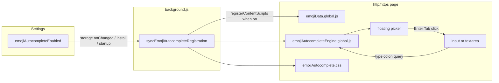

# Emoji typing autocomplete (DTP-OS)

## Decisions (locked)

- **Enabled by default** (`emojiAutocompleteEnabled` defaults to `true`)
- **v1 fields only**: native `input` and `textarea` (no `contenteditable`)
- **Popup Emojis tool stays** as search → copy; this is a separate page overlay
- **Top frame only** (`allFrames: false`) to keep v1 simple

## Architecture

Mirror [Twitch Ad Block registration](js/lib/twitchAdBlockRegistration.js): dynamic `chrome.scripting.registerContentScripts` so the injector is present only while enabled. Use the **ISOLATED** world at `document_idle` (DOM overlay + field value access; no MAIN-world page hooks).

## Permissions

Update [`manifest.json`](manifest.json):

- Add host permissions: `http://*/*`, `https://*/*` (required for persistent registration across sites)
- Bump extension `version`

Chrome internal pages remain out of scope via match patterns.

## Shared emoji data (no duplication)

Today [`js/emoji-data.js`](js/emoji-data.js) is an ES module the popup imports. Content scripts from `registerContentScripts` are classic scripts, so:

1. Move the array into [`js/emojiData.global.js`](js/emojiData.global.js) as `globalThis.DTP_EMOJI_LIST = [...]`
2. Thin-wrap [`js/emoji-data.js`](js/emoji-data.js) as `export const EMOJI_LIST = globalThis.DTP_EMOJI_LIST`
3. Load the classic file before the module in [`popup.html`](popup.html):
   - `` then the existing module script
4. Register content scripts in order: `emojiData.global.js` → engine

Extract shared filter helpers used by popup + engine into [`js/lib/emojiSearch.js`](js/lib/emojiSearch.js) (normalize query, keyword match, rank/limit). For the classic engine, either inline the same tiny helpers or expose them on `globalThis` from a small `emojiSearch.global.js` registered between data and engine — prefer one small `emojiSearch.global.js` so popup can keep using the ES `emojiSearch.js` without drift (duplicate ~20 lines of pure match logic is acceptable if dual-format feels heavy; pick **duplicate pure match helpers in the engine** to avoid a third file, and keep `emojiSearch.js` for the popup only).

## In-page engine behavior

New [`js/inject/emojiAutocompleteEngine.global.js`](js/inject/emojiAutocompleteEngine.global.js) + [`css/emojiAutocomplete.css`](css/emojiAutocomplete.css):

| Behavior | Rule |
|----------|------|
| Trigger | In focused `input`/`textarea`, text before caret matches `(?:^\|[\s(\[{])(:([a-zA-Z][a-zA-Z0-9_+-]*))$` — requires a letter after `:`, avoids times like `12:30` |
| Results | Filter `DTP_EMOJI_LIST` by keyword/emoji substring; show up to **8** matches; update as the query grows |
| UI | Fixed/absolute popover near caret (or under the field if caret coords are awkward); Netflix dark + hot pink accent |
| Keys | `ArrowUp`/`ArrowDown` move highlight; `Enter`/`Tab` insert; `Escape` dismiss; click inserts |
| Insert | Replace the `:query` span with the emoji character; dispatch `input` so React/etc. see the change |
| Dismiss | Blur, empty matches, query cleared, or Escape |
| Skip | `type` in `password`, `email`, `url`, `number`, `date`, hidden, etc.; `readonly`/`disabled` |

Listen with capture-phase `input` + `keydown` on `document` (delegated), not per-field wiring.

## Settings + background sync

New modules (same shape as Twitch):

- [`js/lib/emojiAutocompleteSettings.js`](js/lib/emojiAutocompleteSettings.js) — get/set; **default `true`** when key missing
- [`js/lib/emojiAutocompleteRegistration.js`](js/lib/emojiAutocompleteRegistration.js) — register/unregister script id `dtp-emoji-autocomplete` with matches `http://*/*`, `https://*/*`, `js: [emojiData.global.js, engine]`, `css: [emojiAutocomplete.css]`, `runAt: "document_idle"`, `world: "ISOLATED"`, `persistAcrossSessions: true`

Wire [`background.js`](background.js):

- Sync on `onInstalled`, `onStartup`, `storage.onChanged` for `emojiAutocompleteEnabled`
- Message type `dtp-emoji-autocomplete-sync` (same pattern as `dtp-twitch-adblock-sync`)

Settings UI:

- Add an **Emoji Autocomplete** section in new-tab settings ([`js/newtab.js`](js/newtab.js) sections list) and in popup Settings stack ([`js/settingsTool.js`](js/settingsTool.js))
- Checkbox: “Suggest emojis while typing `:query` in text fields” (on by default)
- Short note: refresh open tabs after toggling

Optional one-line hint under the existing Emojis tool search placeholder — skip unless trivial; settings is the control surface.

## Docs

Update [`docs/architecture.md`](docs/architecture.md) (permissions, registration, new files) and [`docs/wishlist.md`](docs/wishlist.md) / [`README.md`](README.md) features table with a brief line.

## Out of scope (v1)

- `contenteditable` / Slack / Discord / Gmail composers
- iframe / `allFrames`
- Replacing site-native emoji pickers
- Syncing preference to the cloud
