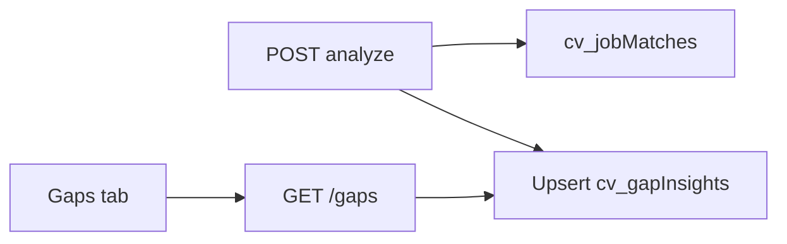

# Gap Insights tracking tab

## Approach

Treat recurring gaps as an **aggregate signal**, not just per-job output.

On every successful `analyze`:
1. Read `meaningfulGaps` and `warnings` from the match result
2. Normalize each requirement name (lowercase, collapse whitespace/punctuation, map common aliases like `k8s` → `kubernetes`)
3. Upsert into a new Mongo collection **`cv_gapInsights`** inside database `DTP`
4. Increment counters and keep recent job references

A new nav tab **Gaps** lists these sorted by frequency.



## Data model (`cv_gapInsights`)

One document per normalized requirement:

```json
{
  "_id": "gap_kafka",
  "normalizedName": "kafka",
  "displayName": "Apache Kafka",
  "kindCounts": { "gap": 12, "warning": 3 },
  "severityCounts": { "high": 8, "critical": 2, "warning": 3, "moderate": 2 },
  "totalSeen": 15,
  "lastSeenAt": "2026-07-18T...",
  "firstSeenAt": "2026-07-18T...",
  "lastJobId": "job_...",
  "lastJobTitle": "Staff Systems Engineer",
  "lastCompany": "Pixar",
  "recentJobIds": ["job_a", "job_b"],
  "sampleReasons": ["..."],
  "status": "open"
}
```

- **`status`**: `open` by default; later you can mark `learning` / `resolved` from the UI (resolved = you added real evidence / skill bank entry)
- Count **once per job** per requirement (re-analyzing the same job updates `lastSeen*` but does not double-count if that `jobId` is already in `recentJobIds`)

## Backend changes

- Add `GAP_INSIGHTS = "cv_gapInsights"` in [`services/shared/cv_shared/collections.py`](file:///Users/argo/Code/dtp/dtp-yui/cv/services/shared/cv_shared/collections.py)
- New module [`services/shared/cv_shared/gap_insights.py`](file:///Users/argo/Code/dtp/dtp-yui/cv/services/shared/cv_shared/gap_insights.py):
  - `normalize_requirement(name)`
  - `record_gaps_from_match(match, job)` called at end of `analyze_job` in [`matching.py`](file:///Users/argo/Code/dtp/dtp-yui/cv/services/shared/cv_shared/matching.py)
- API in [`services/api/main.py`](file:///Users/argo/Code/dtp/dtp-yui/cv/services/api/main.py):
  - `GET /gaps` — sorted by `totalSeen` desc; query params `kind=gap|warning|all`, `status=open|learning|resolved|all`
  - `PATCH /gaps/{id}` — set `status` only
- Index: `totalSeen`, `status`, `normalizedName`

## Frontend

- Nav link **Gaps** in [`services/web/app/layout.js`](file:///Users/argo/Code/dtp/dtp-yui/cv/services/web/app/layout.js)
- New page [`services/web/app/gaps/page.js`](file:///Users/argo/Code/dtp/dtp-yui/cv/services/web/app/gaps/page.js):
  - Ranked table: requirement, times seen, gap vs warning split, last seen job, status
  - Filters: All / Gaps only / Warnings only; Open / Learning / Resolved
  - Row actions: mark Learning / Resolved
  - Color: gap-heavy rows red-leaning, warning-heavy yellow (reuse existing fit styles)
- CSS in [`ui.module.css`](file:///Users/argo/Code/dtp/dtp-yui/cv/services/web/app/ui.module.css) — reuse fit table patterns

## What this intentionally does not do yet

- No automatic skill-bank writes from gaps (avoids inventing experience)
- No backfill of historical matches unless you click a one-shot “Rebuild from existing matches” button (include a small `POST /gaps/rebuild` that scans `cv_jobMatches` once — useful so your current analyses populate the tab immediately)

## Docs

- Note collection in [`docs/COLLECTIONS.md`](file:///Users/argo/Code/dtp/dtp-yui/cv/docs/COLLECTIONS.md)
- Short blurb in [`cv/README.md`](file:///Users/argo/Code/dtp/dtp-yui/cv/README.md)
