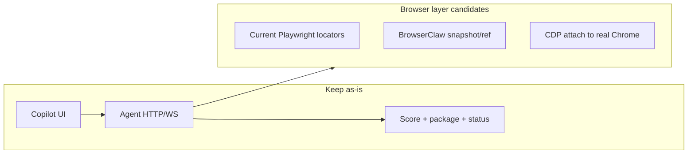

# OpenClaw / BrowserClaw effort estimate

## Important clarification

**[BrowserClaw](https://github.com/idan-rubin/browserclaw)** (born from **[OpenClaw](https://github.com/openclaw/openclaw)**) is an AI-native automation layer (**a11y snapshot + `@eN` refs**). It is still **built on Playwright** under the hood. Adopting it does **not** mean “no Playwright,” and it does **not** by itself fix Cloudflare fingerprinting of Playwright-launched Chrome.

What it *does* buy you: a better interaction model for LLM-driven “what do I click next?” steps, optional obstacle recovery / learned skills (via [browserclaw-agent](https://github.com/idan-rubin/browserclaw-agent)), and less brittle CSS selectors for unknown ATS pages.

Your Cloudflare pain is mostly about **how the browser is launched / fingerprinted**, not about CSS vs snapshot refs. That problem is better addressed by **CDP attach to a user-started Chrome** (still can keep Playwright or BrowserClaw on top).

## What you have today

- Agent: ~4k LOC in [`cv/services/agent/src`](cv/services/agent/src); **~75% tightly coupled** to Playwright (`page.locator`, `launchPersistentContext`, CDP screencast, init scripts).
- Deterministic product: Glassdoor discovery → score gate → package → Indeed Smart Apply heuristics → human approve submit ([`runner.js`](cv/services/agent/src/runner.js), [`ats/indeedSmartApply.js`](cv/services/agent/src/ats/indeedSmartApply.js)).
- Brain stays in FastAPI (score, cover letter/resume package, application status) — **unchanged** by any browser-layer swap.
- Prior plan already noted Stagehand for generic ATS later; no OpenClaw mentions in-repo.

## Effort by approach

### A. Embed BrowserClaw as the hands (keep your runner brain) — **~1.5–3 weeks**

Replace locator-heavy DOM code with snapshot/ref calls inside the existing Node agent loop.

| Keep | Rewrite |
|---|---|
| Copilot UI, `:8010` contract, policy, score/package, approve-submit | [`browser.js`](cv/services/agent/src/browser.js) launch wrap, [`ats/common.js`](cv/services/agent/src/ats/common.js), Indeed/Glassdoor adapters, parts of preview/takeover |

- **Scope:** ~2.5–3k LOC of browser/DOM surface touched or replaced.
- **Risk:** Medium. Indeed path is already specialized; biggest win is [`generic.js`](cv/services/agent/src/ats/generic.js) + unknown modules, not the happy-path Smart Apply wizard.
- **Cloudflare:** Unchanged unless you also change launch/attach.
- **Playwright:** Still a dependency.

### B. Replace the runner with browserclaw-agent (LLM drives apply) — **~4–8 weeks**

Swap deterministic ATS state machine for an LLM agent loop (skills, obstacle recovery).

- Re-spec product: when LLM may act, how it respects **no CAPTCHA bypass**, **AUTO_YES tech**, **ASK_USER legal**, **human submit approval**, cover-letter attach from package.
- Rebuild Glassdoor card loop + Indeed wizard as goals/skills instead of modules.
- Wire Copilot Input / Approve submit into the new agent’s ask-human hooks.
- **Risk:** High (behavior drift, cost/latency per job, harder App-Store-style predictability).
- **Cloudflare:** May help *if* their anti-bot helpers cover Turnstile and you accept that policy tradeoff; your current policy forbids CAPTCHA bypass.

### C. Recommended first: CDP attach to your real Chrome (+ keep Playwright or add BrowserClaw later) — **~3–7 days**

Addresses the actual pain (fresh Playwright profile / automation signals) without rewriting ATS logic.

1. You start normal Chrome with remote debugging (or agent spawns it once with a dedicated debug profile).
2. Agent uses `chromium.connectOverCDP` instead of `launchPersistentContext`.
3. Keep Indeed/Glassdoor adapters mostly as-is.
4. Preview already uses CDP screencast on Chromium ([`preview.js`](cv/services/agent/src/preview.js)).

- **Cloudflare:** Best bang for buck among these options.
- **OpenClaw:** Orthogonal; can layer BrowserClaw later for generic ATS only.

### D. Full “delete Playwright” (browser-use / raw CDP / other) — **~6–12+ weeks**

Only if the hard requirement is zero Playwright. Means rewriting launch, every adapter, preview, and takeover against a new primitive set (and possibly leaving Node for Python if choosing browser-use).

## Recommendation

1. **Do not replace Playwright with OpenClaw expecting Cloudflare relief** — BrowserClaw still uses Playwright.
2. **Short term (~1 week):** implement **CDP attach to system Chrome** (approach C).
3. **Medium term (optional ~2 weeks):** adopt **BrowserClaw only for generic / unknown ATS steps** (slice of A), keep deterministic Indeed path.
4. **Defer B** unless you want the product to become an LLM apply agent (different reliability/cost model).

## If you green-light implementation next

Start with C only: `CV_AGENT_CDP_URL=http://127.0.0.1:9222`, connect path in [`browser.js`](cv/services/agent/src/browser.js), docs for launching Chrome with `--remote-debugging-port=9222` and a dedicated user-data-dir (never the live daily profile while Chrome is open), keep approval + policy gates unchanged.
