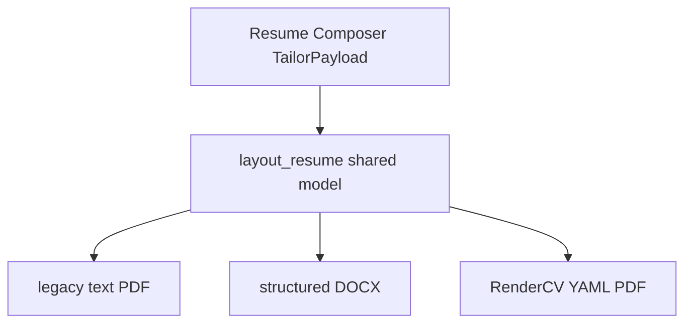

# Optimize resume layout toward target engineering resume

## Diagnosis

The generated resume is not only a content-tuning issue. Renderer structure + tailor selection diverge from the desired layout in several hard ways:

| Desired | Current | Root cause |
|---------|---------|------------|
| One **Capital One** block with stacked titles (2022–24 / 2020–22 / 2018–20) then shared bullets | Three separate job headers; titles can appear out of level order (Senior before Associate before Principal) | [`render_docx.py`](cv/services/shared/cv_shared/resume/render_docx.py) / [`legacy.py`](cv/services/shared/cv_shared/resume/legacy.py) group bullets by `workHistory` **role id** and order roles by first selected achievement—not by company or date |
| **INDEPENDENT SOFTWARE ENGINEER** with themed project blocks | Often missing or thin; hard-coded Oakland founder line only when projects selected | Projects only render if selected achievement ids are `kind=project`; system resume is CapOne-heavy for DevInfra roles |
| Header: professional title + specialty line + compact contact | Name → contact → JD title as `targetRole` | Header is not a first-class layout; `targetRole` is often the job title |
| Highlights as **career milestones** (promotions, platform span, ownership) | Highlights are rewritten **job bullets** (tool lists) | Highlights reuse achievement rewrites with no milestone rules |
| **CORE EXPERTISE** dense line + deeper tech section | Sparse grouped skills (Cloud lists many AWS variants; missing TypeScript/Swift/etc.) | Tailor under-selects skills; group labels too narrow for dual product+infra profile |
| Clean SUMMARY spanning CapOne + independent product work | CapOne-only progression + tool laundry | Composer prompt + `positioningSummaries.systems` bias + skill/project under-selection |
| No footer “Tailored for…” | Present | Explicit line in renderers |

Grounding remains: no invented employers, dates, metrics, or tech. Milestone highlights must be derivable from work history titles/dates, selected bullets, or approved skills/projects only.

## Approach

Split work into **layout engine** (deterministic structure) and **content composer** (selection + narrative rewrite), applied to all three render paths (plain text / DOCX / RenderCV).



### 1. Shared layout model: consolidate employers + order roles

Add [`cv/services/shared/cv_shared/resume/layout.py`](cv/services/shared/cv_shared/resume/layout.py):

- **`group_work_by_employer(work_history, selected_ids, catalog, payload)`**
  - Bucket selected work bullets under company name (normalize case strip).
  - Under each company, list **all titles** for that company present in `work_history` that contribute selected bullets (or all CapOne roles if any bullet from CapOne is selected—prefer listing full progression for consecutive same-company tenure when any role selected, using actual start/end dates).
  - Sort company blocks by most recent end date; sort stacked titles **newest first**.
  - Output shape:
    ```text
    Capital One — McLean, VA
    Principal Associate Software Engineer (2022–2024)
    Senior Associate Software Engineer (2020–2022)
    Associate Software Engineer (2018–2020)
    {intro line optional}
    • bullets (deduped across roles, still sourceId-grounded)
    ```
  - Format dates as `YYYY–YYYY` for stacked titles (drop day/month noise).

- **`group_projects(...)`** for Independent section:
  - Header: `INDEPENDENT SOFTWARE ENGINEER` / `November 2025 – Present | {location}` (location from `candidate.location` or a candidate field `independentTitle`/`independentPeriod` if we add optional seed fields; default period from first project `startDate` or fixed string only if already in seed).
  - Subheads: project `name` (or a short category derived from project tags if present: Product Platform / AI / Media—only when fields exist or map known project ids; otherwise project name only).
  - Bullets only from selected project achievements.

- **Contact cleanup**: strip `https://`, show `linkedin.com/...` and `github.com/...`; phone as stored; location as stored (user sample uses SF—leave location data-driven, not hard-coded SF unless candidate record is updated).

Wire `build_tailored_resume_lines`, `render_tailored_docx`, and `build_rendercv_data` through this layout so PDF/DOCX/txt stay aligned.

### 2. Resume section order and labels

Default section order becomes:

`summary` → `highlights` → `skills` → `experience` → `projects` → `technologies` → `education`

- Labels: `SUMMARY`, `SELECTED HIGHLIGHTS`, `CORE EXPERTISE`, `EXPERIENCE`, `INDEPENDENT SOFTWARE ENGINEER`, `TECHNOLOGIES`, `EDUCATION`
- Drop the “Tailored for: …” footer from rendered artifacts (keep only in selection-report / package metadata).
- Optional light horizontal rule as plain text `---` / thin paragraph border in DOCX between header and body / before education—not required for ATS if too decorative; use a single blank line + ALL-CAPS headings first; add rule only in DOCX if easy.

### 3. Header + professional positioning

Extend `TailorPayload` (verified, optional fields with safe defaults):

| Field | Purpose |
|-------|---------|
| `professionalTitle` | e.g. “Principal Software Engineer” (positioning headline—not a fabricated CapOne title) |
| `specialtyLine` | e.g. “Distributed Systems • Cloud Infrastructure • …” built only from approved skill/role-family tokens |
| `targetRole` | keep for job-fit; display secondary or omit from header if `professionalTitle` set |

Composer system prompt: for infra roles still keep enterprise credibility, but summary **must** mention independent end-to-end product work when any project is selected.

Renderer header order:
1. Name  
2. `professionalTitle` or `targetRole`  
3. `specialtyLine` if present  
4. Contact line(s)

### 4. Highlights as milestones (still grounded)

Change highlight guidance in [`package/prompts.py`](cv/services/shared/cv_shared/package/prompts.py) + tailor user prompt:

- Highlights are **not** re-rendered CapOne CI/CD bullets.
- Prefer 4–6 lines drawable from verified data:
  - Promotion/levels: if ≥2 distinct titles at same company in catalog (true for CapOne seed)
  - Systems span: only if selected projects include web/mobile/cloud or work bullets support it
  - Ownership / product end-to-end from project selections
  - Cap infrastructure theme without tool laundry (at most a short tech phrase if source has it)
- Keep `highlights: [{sourceId, text}]` when tied to a bullet **or** allow synthetic source ids for milestones only when computed by code (cleaner):

**Chosen approach (concrete):** generate milestone highlights **deterministically post-verify** in layout/tailor when LLM highlights are weak/tool-y, using rules:

1. If CapOne has ≥2 titles → “Promoted through {n} engineering levels at Capital One.”  
2. If any project selected → “Architecting end-to-end products spanning …` from project kinds/skills.”  
3. Top 3 work bullets rewritten briefly as impact themes (existing rewrite safety).  
4. Deduplicate against experience bullets.

Verify still rejects unsafe employer invention.

### 5. Skills / technologies selection

Composer + deterministic fallback:

- Always include a broader **approved skill ceiling** for two-page packages (e.g. up to ~24 skills) not ~6.
- Two render modes from one selection:
  - **CORE EXPERTISE**: flat ` • `-joined short list ordered by role relevance (Languages/Cloud/infra/product blended).
  - **TECHNOLOGIES**: category lines (Languages / AWS / Tools) from skill categories—only names in approved skills.

Prompt: for DevInfra jobs still bias cloud/CI/obs upward, but **do not drop** product languages if they appear on approved projects/seed skills.

### 6. Summary rewrite rules

Update `RESUME_COMPOSER_SYSTEM`:

- ~50–90 words
- Structure: seniority framing → CapOne tenure & themes → independent systems/product work if projects selected → one role-matching differentiator
- Ban progressive title list as half the paragraph; one short promote clause is enough
- Ban packing >4 technology names into summary

### 7. Force project inclusion for dual profile

In ranker/composer (and deterministic fallback): when `pages=2`, reserve **at least 3–5 project bullets** (or min 2 projects) unless catalog has none approved. Prevents CapOne-only pages when independent work exists (matches desired second half).

### 8. Candidate seed polish (small)

Optional one-line tweaks in [`cv/seed/candidates.json`](cv/seed/candidates.json) only if needed for layout (e.g. `professionalTitle`, `specialtyLine`, `independentRoleLabel`)—prefer LLM/layout defaults first; add seed fields only for stable header defaults without inventing job-specific claims.

### 9. Docs

Update [`cv/docs/RESUME_PIPELINE.md`](cv/docs/RESUME_PIPELINE.md): employer consolidation, independent section, section labels, skills dual display.

## Files to change

- New: [`resume/layout.py`](cv/services/shared/cv_shared/resume/layout.py)
- Update: [`legacy.py`](cv/services/shared/cv_shared/resume/legacy.py), [`render_docx.py`](cv/services/shared/cv_shared/resume/render_docx.py), [`render_rendercv.py`](cv/services/shared/cv_shared/resume/render_rendercv.py)
- Update: [`tailor.py`](cv/services/shared/cv_shared/resume/tailor.py) (payload fields, project floor, skill caps, milestone highlight helpers)
- Update: [`package/prompts.py`](cv/services/shared/cv_shared/package/prompts.py) (composer voice + highlights + skills)
- Update: docs

## Out of scope

- Uploading a master DOCX template as source of truth
- Fabricating SF location, team size, or tech not in skill bank
- Perfect pixel match of decorative rules in RenderCV themes
- Cover letter changes (already elevated separately)

## Success criteria (regenerate DevInfra package)

1. Single Capital One employer block with three stacked titles newest-first  
2. Independent Software Engineer section with multiple project subheads when projects selected  
3. SUMMARY mentions both CapOne platform work and independent product/systems work  
4. Highlights read as milestones, not CI/CD bullet clones  
5. CORE EXPERTISE denser; TECHNOLOGIES lists more approved stack items  
6. No “Tailored for…” footer; cleaner contact URLs  
7. All bullets still map to verified `sourceId`s / approved skills
