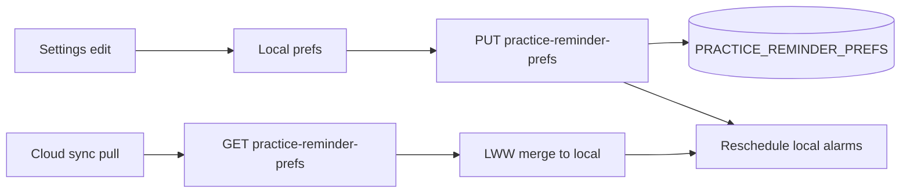

# Cross-device reminder sync and Web Push

## Scope (committed)
- **Sync** daily + weekly class reminder preferences across web / iOS / Android through Pocket.
- **Native delivery stays local** (`UNUserNotificationCenter` / `AlarmManager`) after prefs pull or edit — no FCM/APNs in this pass.
- **Web closed-tab delivery** via Web Push + a scheduled Pocket sender (EventBridge or equivalent).
- **Not synced:** per-device “practiced today” skip date; derive skip from local practice/journal (and after sync, from cloud structured sessions where already available).

## Shared wire contract
Add Dynamo row on the app table: `PK=USER#{logtoSub}`, `SK=PRACTICE_REMINDER_PREFS`.

```json
{
  "prefs": {
    "dailyEnabled": false,
    "dailyHour": 18,
    "dailyMinute": 0,
    "classEndEnabled": true,
    "weeklyClasses": [
      {
        "id": "uuid-lowercase",
        "name": "House",
        "weekday": 2,
        "startHour": 18,
        "startMinute": 0,
        "endHour": 19,
        "endMinute": 0
      }
    ],
    "timeZone": "America/Los_Angeles"
  },
  "updatedAt": "ISO-8601"
}
```

- `weekday`: **1=Sunday … 7=Saturday** (match current iOS/web). Convert Android ISO `DayOfWeek` on read/write.
- Default daily hour **18** everywhere (Android currently defaults to 19 — normalize on first sync merge).
- `classEndEnabled`: add to iOS (today classes always schedule when authorized).
- `timeZone`: IANA string from the device that last saved prefs; required for the cloud Web Push scheduler.
- LWW on `updatedAt` (same pattern as session presets).

## Phase 1 — Prefs API + client sync

### Pocket
- Add `pocketSk.practiceReminderPrefs()` in [`pocketKeys.js`](/Users/argo/Code/sway/sway-pocket/ui/lib/server/pocketKeys.js).
- New routes [`GET/PUT /api/pocket/me/practice-reminder-prefs`](/Users/argo/Code/sway/sway-pocket/ui/app/api/pocket/) mirroring [`session-presets/route.js`](/Users/argo/Code/sway/sway-pocket/ui/app/api/pocket/session-presets/route.js): normalize body, always write row + `updatedAt`, return `{ prefs, updatedAt }`.
- Auth: signed-in Pocket user (`withPocket` / bearer as presets); guests keep local-only prefs and skip cloud.
- Server normalize module (clamp hours, weekday, class ids) + unit tests.

### Web
- Client helper (like `sessionPresetClient.js`): get/put prefs.
- On Settings change: write localStorage, PUT cloud, `reschedulePracticeReminders()`.
- On app bootstrap / auth ready: GET cloud, LWW-merge into local, set `timeZone` from `Intl.DateTimeFormat().resolvedOptions().timeZone` if missing, reschedule.
- Keep [`practiceReminderPreference.js`](/Users/argo/Code/sway/sway-pocket/ui/lib/practiceReminderPreference.js) as local cache; update Settings copy to say prefs sync when signed in.

### iOS
- Extend [`PracticeReminderSettings`](/Users/argo/Code/sway-ios/player/player/Services/Reminders/PracticeReminderSettings.swift) with `classEndEnabled` + `timeZone`.
- Add Pocket payload + GET/PUT on [`PocketAPIClient`](/Users/argo/Code/sway-ios/player/player/Services/CloudSync/PocketAPIClient.swift).
- Pull prefs in [`CloudSyncCoordinator`](/Users/argo/Code/sway-ios/player/player/Services/CloudSync/CloudSyncCoordinator.swift) (with or just after other pulls); apply LWW; call existing `PracticeReminderScheduler.rescheduleAll`.
- Push prefs when Settings change (if cloud sync enabled), then reschedule.
- Gate class-end scheduling on `classEndEnabled`.

### Android
- Map wire weekday ↔ ISO in one helper; store wire/Sunday=1 in prefs JSON going forward (migrate existing local slots once).
- Align default hour to 18 on first cloud merge if user never customized.
- Pull/push in [`CloudSyncCoordinator`](/Users/argo/Code/sway-android/sway-player-android/app/src/main/java/com/swayquest/swayplayer/service/sync/CloudSyncCoordinator.kt); after pull call `practiceReminderScheduler.rescheduleAll()` (missing today).
- Settings edits: local write → PUT → `rescheduleAll`.



## Phase 2 — Web Push (closed-tab)

### Subscription storage
- Dynamo: `SK=PUSH_SUB#{endpointHash}` under same user PK; attrs `endpoint`, `p256dh`, `auth`, `userAgent`, `updatedAt`.
- Routes: `GET/POST/DELETE /api/pocket/me/push-subscriptions` (bearer required).

### Client / SW
- Env: `NEXT_PUBLIC_VAPID_PUBLIC_KEY` + server `VAPID_PRIVATE_KEY` / `VAPID_SUBJECT`.
- After notification permission grant in Settings: `PushManager.subscribe`, POST subscription.
- Extend [`sw-reminders.js`](/Users/argo/Code/sway/sway-pocket/ui/public/sw-reminders.js) with a `push` handler that `showNotification`s and keep existing `notificationclick` → `/progress?addJournal=1`.
- Fix SW registration lookup to use scope `/` (current `getRegistration('/sw-reminders.js')` is unreliable).

### Server sender
- Add a small Node sender (Pocket API route protected by cron secret, or Lambda in sway-pocket/sway-sls) using `web-push`.
- Schedule: EventBridge rule every 1 minute (or 5) that lists users with `dailyEnabled` / class-end due in the current UTC window for their `prefs.timeZone`, skips if that local day already has a completed journal/`STRUCTURED_PS` (or a lightweight “reminder fired” marker), then sends push.
- Payload: `{ title, body, url: "/progress?addJournal=1", tag }` — daily vs class-end tags must stay stable to avoid spam.
- Delete dead subscriptions on `410 Gone`.

### Delivery matrix after this work
| Client | Prefs | Alert delivery |
|--------|-------|----------------|
| iOS / Android | Synced | Local OS notifications |
| Web tab open | Synced | Existing in-page timers (optional keep) |
| Web tab closed | Synced | Web Push from scheduler |

## Docs / QA
- Update [`SWAY-POCKET-FEATURE-PARITY.md`](/Users/argo/Code/sway/sway-pocket/docs/SWAY-POCKET-FEATURE-PARITY.md), [`POCKET-UI-QA.md`](/Users/argo/Code/sway/sway-pocket/docs/POCKET-UI-QA.md), iOS Profile README / FEATURES, Android ARCHITECTURE: prefs sync when signed in; Web Push env; timezone; weekday convention.
- Manual QA: edit class on web → appears on phone after sync; edit on phone → web; Web Push with tab closed; practiced-today skip still suppresses daily.

## Out of scope
- FCM / APNs server push to native apps.
- Syncing theme / upload-quality / other `uiPreferences`.
- Exact-alarm upgrades or changing native Doze behavior.